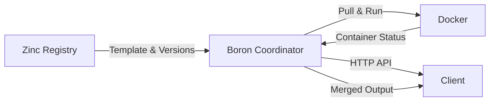
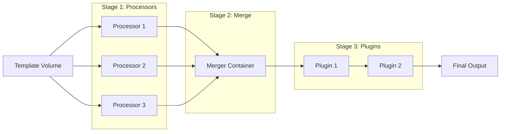

# Boron Developer Documentation

**Boron** is the execution coordinator for the Cyanprint system. It orchestrates Docker containers running processors and plugins to transform template-based code generation projects.

## What Boron Does

Boron manages the complete execution lifecycle of Cyanprint templates:

1. **Session Management** - Isolates each execution with dedicated containers and volumes
2. **Version Resolution** - Queries the registry to resolve processor and plugin versions
3. **Parallel Execution** - Runs multiple processors concurrently with semaphore-based control
4. **File Merging** - Consolidates processor outputs into a single merged directory
5. **Plugin Pipeline** - Applies plugins sequentially to the merged output
6. **Health Checks** - Waits for containers to be ready before proceeding
7. **Cleanup** - Removes session-scoped containers and volumes after execution

## Quick Navigation

| Section | Description | Start Here |
|---------|-------------|------------|
| [Getting Started](./01-getting-started.md) | Installation, setup, and first run | New users |
| [Architecture](./02-architecture.md) | High-level system design and components | Understanding the big picture |
| [Features](./features/) | What Boron does and how it works | Learning specific capabilities |
| [Modules](./modules/) | Code organization and structure | Navigating the codebase |
| [Surfaces](./surfaces/) | HTTP API endpoints and contracts | Integrating with Boron |
| [Algorithms](./algorithms/) | Implementation details for complex logic | Deep dive into internals |

## System Context

Boron sits between the **Zinc** registry and Docker, coordinating the execution of templates:

| Component | Role |
|-----------|------|
| **Zinc Registry** | Stores templates, processors, and plugins with version metadata |
| **Boron** | Orchestrates execution, manages containers, merges outputs |
| **Docker** | Runs isolated containers for each processor and plugin |
| **Client** | Initiates builds and receives zipped results |

## Key Concepts

| Concept | Description | Link |
|---------|-------------|------|
| **Session** | Isolated execution context with dedicated containers/volumes | [Session Management](./features/01-session-management.md) |
| **Template** | Code generation template with processors and plugins | [Warming System](./features/07-warming-system.md) |
| **Processor** | Container that transforms input files to output files | [Processor Isolation](./features/04-processor-isolation.md) |
| **Plugin** | Container that post-processes merged output | [Plugin Lifecycle](./features/06-plugin-lifecycle.md) |
| **Merger** | Container that consolidates processor outputs | [Merger System](./features/03-merger-system.md) |

## Architecture Overview

Boron uses a **3-stage pipeline**:

| Stage | What Happens | Parallel? |
|-------|--------------|-----------|
| 1 | Processors read from template volume, write to work areas | Yes (semaphore-limited) |
| 2 | Merger consolidates all processor outputs | Single container |
| 3 | Plugins process merged output sequentially | No (sequential) |

## Getting Started

1. **Read** [Getting Started](./01-getting-started.md) for setup instructions
2. **Review** [Architecture](./02-architecture.md) for system design
3. **Explore** [Features](./features/) to understand capabilities
4. **Reference** [Surfaces](./surfaces/) for API integration

## Technology Stack

| Component | Technology | Purpose |
|-----------|------------|---------|
| HTTP Server | Gin | REST API for build initiation |
| Container Runtime | Docker | Isolated execution environments |
| Orchestration | Go goroutines + channels | Parallel execution control |
| Networking | Docker bridge network | Inter-container communication |
