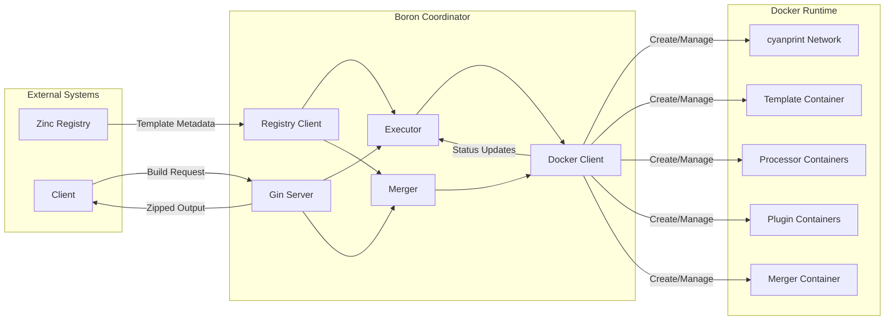
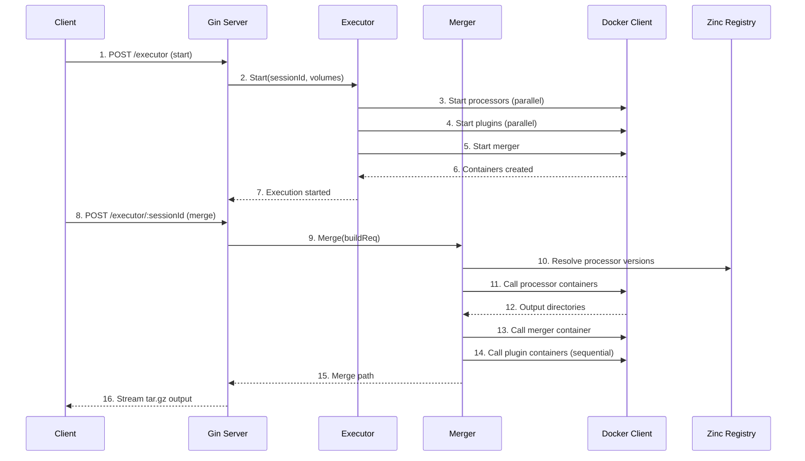
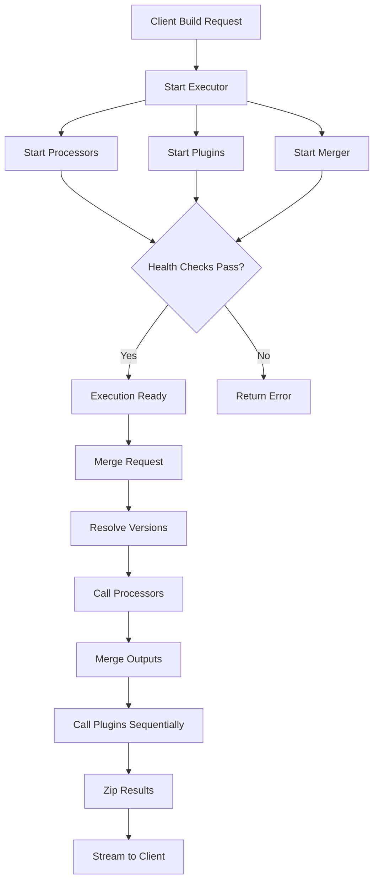
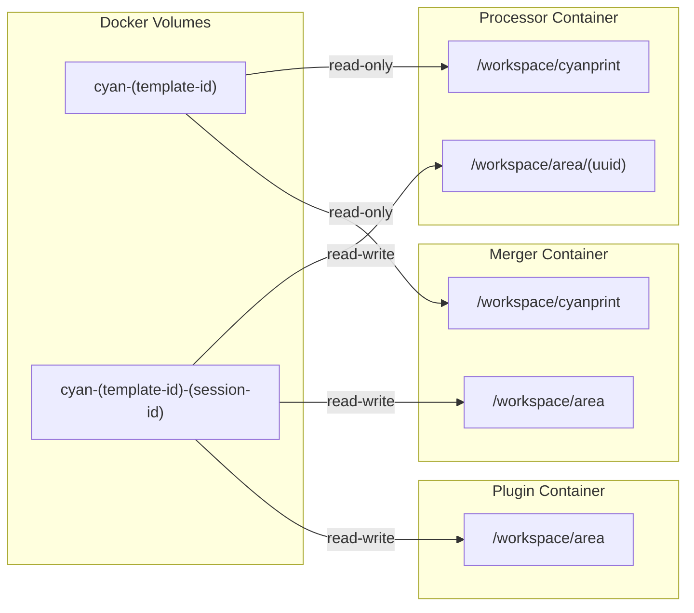

# Architecture

## Overview

Boron is a **3-stage execution coordinator** that orchestrates Docker containers to transform template-based projects. It runs processors in parallel, merges their outputs, and applies plugins sequentially to produce the final result.

**Key Files**: `server.go:28`, `docker_executor/executor.go:10`, `docker_executor/merger.go:15`

## System Context

### High-Level View

| Component           | Role                                                            | Key Files        |
| ------------------- | --------------------------------------------------------------- | ---------------- |
| **Zinc Registry**   | Stores templates, processors, plugins with version metadata     | External service |
| **Gin Server**      | HTTP API for build initiation, warm, cleanup                    | `server.go:28`   |
| **Executor**        | Orchestrates container lifecycle (start, health check, cleanup) | `executor.go:10` |
| **Merger**          | Coordinates 3-stage pipeline execution                          | `merger.go:15`   |
| **Registry Client** | Resolves processor/plugin versions from Zinc                    | `registry.go:11` |
| **Docker Client**   | Manages containers, volumes, images, networks                   | `docker.go:18`   |

### Component Interaction

| #   | Step             | What                                    | Key File          |
| --- | ---------------- | --------------------------------------- | ----------------- |
| 1   | Start request    | Client initiates execution              | `server.go:183`   |
| 2   | Delegate         | Server calls executor to orchestrate    | `server.go:231`   |
| 3   | Start processors | Launch processor containers in parallel | `executor.go:93`  |
| 4   | Start plugins    | Launch plugin containers in parallel    | `executor.go:153` |
| 5   | Start merger     | Launch merger container                 | `executor.go:61`  |
| 6   | Created          | Docker confirms container creation      | `docker.go:177`   |
| 7   | Started          | Server returns OK to client             | `server.go:242`   |
| 8   | Merge request    | Client requests merged output           | `server.go:68`    |
| 9   | Delegate         | Server creates merger, calls Merge      | `server.go:86`    |
| 10  | Resolve          | Query Zinc for processor versions       | `registry.go:147` |
| 11  | Process          | Call each processor container via HTTP  | `merger.go:102`   |
| 12  | Outputs          | Processors return output directories    | `merger.go:144`   |
| 13  | Merge            | Call merger container to consolidate    | `merger.go:238`   |
| 14  | Plugins          | Call plugins sequentially               | `merger.go:179`   |
| 15  | Path             | Return merged output path               | `merger.go:296`   |
| 16  | Stream           | Server streams zipped output            | `server.go:169`   |

## Key Components

| Component             | Purpose                                                       | Key Files                        |
| --------------------- | ------------------------------------------------------------- | -------------------------------- |
| **Gin Server**        | HTTP API for build orchestration, warm, cleanup, and proxying | `server.go:28`                   |
| **Executor**          | Container lifecycle management (start, health check, clean)   | `executor.go:10`, `docker.go:18` |
| **Merger**            | 3-stage pipeline coordination                                 | `merger.go:15`                   |
| **Registry Client**   | Version resolution from Zinc                                  | `registry.go:11`                 |
| **Template Executor** | Template warming (pre-pull, volume creation)                  | `template_executor.go:10`        |
| **Domain Models**     | Container/volume/image naming conventions                     | `domain_model.go`                |

## Key Decisions

### 1. Two-Volume Architecture

**Context**: Processors need read-only access to templates but write access for outputs.

**Decision**: Mount two volumes per container:

- `/workspace/cyanprint` (read-only) - Template volume
- `/workspace/area` (read-write) - Work area for outputs

**Rationale**: Prevents processors from modifying templates while allowing parallel writes to isolated work areas.

**Key File**: `docker.go:328` → `CreateContainerWithReadWriteVolume()`

### 2. Semaphore-Based Parallelism

**Context**: Need to limit concurrent container starts based on CPU cores.

**Decision**: Use buffered channels as semaphores with size `NumCPU()`.

**Rationale**: Prevents resource exhaustion while maximizing CPU utilization. Go channels provide clean synchronization without locks.

**Key File**: `executor.go:98` → `startProcessors()`

### 3. 3-Stage Pipeline

**Context**: Processors produce outputs that need consolidation before plugins modify them.

**Decision**: Execute processors in parallel, merge outputs, then run plugins sequentially.

**Rationale**: Maximizes parallelism for expensive transformations while ensuring plugins see a complete, consistent state.

**Key File**: `merger.go:296` → `Merge()`

### 4. Separate Merger Container

**Context**: File merging logic needs to run in an isolated environment.

**Decision**: Use a dedicated "merger" container that runs the Boron image itself.

**Rationale**: Reuses existing HTTP endpoints (`/merge`, `/zip`) without adding complexity to the coordinator. The merger container runs independently from the coordinator process, allowing the merge operation to execute in its own containerized environment.

**Key File**: `server.go:503` → `/merge/:sessionId` endpoint

**Implementation**: The merger container runs the same Boron image as the coordinator (`GetCoordinatorImage()`). It only responds to the `/merge/:sessionId` endpoint, which calls `MergeFiles()` to consolidate processor outputs.

### 5. Merger Volume Mounts

**Context**: The merger container inherits the same volume mounting pattern as processors.

**Decision**: Merger mounts both template volume (RO at `/workspace/cyanprint`) and session volume (RW at `/workspace/area`).

**Reality**: The merger only uses the session volume. `MergeFiles()` copies from processor output dirs (in session volume) to merged output (also in session volume). The template volume mount is effectively unused.

**Key Files**: `executor.go:75` → container creation, `merger.go:264` → `MergeFiles()`

### 6. Bridge Network over Container Links

**Context**: Containers need to communicate via HTTP (health checks, API calls).

**Decision**: Use a shared Docker bridge network (`cyanprint`) with predictable container names.

**Rationale**: Allows containers to address each other by name (e.g., `http://cyan-processor-uuid-session:5551`) without port mapping or DNS complexity.

**Key File**: `docker.go:391` → `EnforceNetwork()`

### 7. Health Check Polling

**Context**: Containers take time to start up; need to know when they're ready.

**Decision**: Poll HTTP endpoint every second for up to 60 attempts.

**Rationale**: Simple implementation that works across all container types. No need for complex sidecar or dependency management.

**Key File**: `executor.go:266` → `statusCheck()`

## Data Flow

### Execution Flow

### Volume Mounting

| Container | /workspace/cyanprint        | /workspace/area                    |
| --------- | --------------------------- | ---------------------------------- |
| Processor | Template volume (read-only) | Unique UUID work area (read-write) |
| Merger    | Template volume (read-only) | Session volume (read-write)        |
| Plugin    | Not mounted                 | Session volume (read-write)        |
