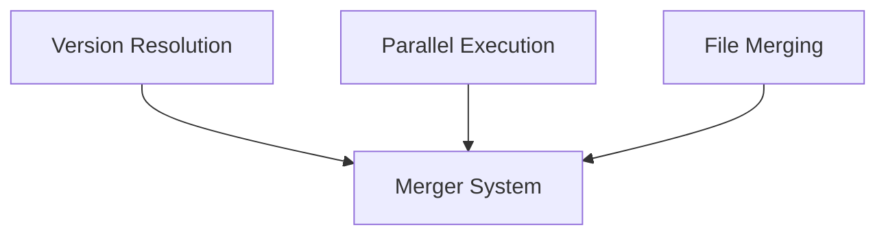

# Algorithms Overview

This section contains detailed implementation algorithms for complex logic in Boron.

## Map

| Algorithm              | Used By                                                            | Purpose                                                      |
| ---------------------- | ------------------------------------------------------------------ | ------------------------------------------------------------ |
| **Version Resolution** | [Version Resolution Feature](../features/02-version-resolution.md) | Query registry, iterate versions to find compatible match    |
| **Parallel Execution** | [Parallel Execution Feature](../features/05-parallel-execution.md) | Semaphore-based concurrency control for container operations |
| **File Merging**       | [Merger System Feature](../features/03-merger-system.md)           | Walk output directories and consolidate files                |

## All Algorithms

| Algorithm                                        | What                                                           | Why                                                  | Key Files                         |
| ------------------------------------------------ | -------------------------------------------------------------- | ---------------------------------------------------- | --------------------------------- |
| [Version Resolution](./01-version-resolution.md) | Iterates from latest version to find compatible template match | Support flexible version references with fallback    | `registry.go:147`                 |
| [Parallel Execution](./02-parallel-execution.md) | Semaphore-based concurrent container starts and HTTP calls     | Maximize CPU utilization without resource exhaustion | `executor.go:98`, `merger.go:102` |
| [File Merging](./03-file-merging.md)             | Walk directories, copy files to merge output                   | Consolidate parallel processor outputs               | `merger.go:264`                   |

## Groups

### Group 1: Pipeline Algorithms

- **[Version Resolution](./01-version-resolution.md)** - Registry version iteration
- **[File Merging](./03-file-merging.md)** - Directory consolidation

### Group 2: Concurrency Algorithms

- **[Parallel Execution](./02-parallel-execution.md)** - Semaphore-based control
