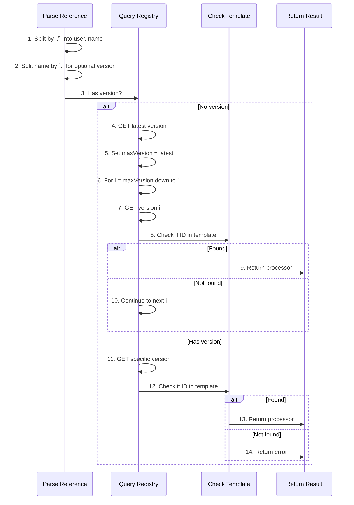

# Version Resolution Algorithm

**Used by**:

- [Version Resolution Feature](../features/02-version-resolution.md)
- [Merger System](../features/03-merger-system.md)

## Overview

The version resolution algorithm converts flexible processor/plugin references (like `user/processor` or `user/processor:3`) into concrete template-defined IDs. When no version is specified, it iterates from the latest version down to find the first match in the template.

This enables clients to use `username/name` (no version) references while ensuring the resolved version actually exists in the template definition.

**Background**: See [Template vs Cyan Processors](../concepts/template-vs-cyan-processors.md) for why two separate processor lists exist.

## Input/Output

| Input                | Type             | Description                                                                                               |
| -------------------- | ---------------- | --------------------------------------------------------------------------------------------------------- |
| `cyanName`           | `string`         | Reference from script's Cyan object: `"user/processor"` (versionless) or `"user/processor:3"` (versioned) |
| `templateProcessors` | `[]ProcessorRes` | Processors from template (pinned at push time with IDs, versions, Docker info)                            |

| Output      | Type            | Description                                                     |
| ----------- | --------------- | --------------------------------------------------------------- |
| `processor` | `CyanProcessor` | Resolved processor with ID, version, Docker info, config, files |
| `error`     | `error`         | Error if no match found or invalid reference                    |

### What "Found" Means

"Found" means: **the processor ID returned from the registry exists in the template's processor list**.

**Example:**

1. Script says: `atomi/typescript`
2. Registry returns: `{ID: "proc-ts-456", Version: 2}`
3. Template contains: `{Processors: [{ID: "proc-ts-456", ...}, {ID: "proc-eslint-789", ...}]}`
4. Check: Is `"proc-ts-456"` in the template's processor list? → **Yes** ✓ = "found"

If a newer version exists in the registry but wasn't included in the template, it won't be "found" - this prevents using untested processor versions.

**See [Template vs Cyan Processors](../concepts/template-vs-cyan-processors.md)** for full context on why templates work this way.

## Steps

| #   | Step     | What                                                       | Why                                  | Key File                          |
| --- | -------- | ---------------------------------------------------------- | ------------------------------------ | --------------------------------- |
| 1   | Parse    | Split name by `:` for optional version                     | Extract version if specified         | `merger.go:87`                    |
| 2   | Parse    | Split by `/` into user and name                            | Extract username and processor name  | `merger.go:95`                    |
| 3   | Check    | Determine if version was specified                         | Choose resolution path               | `docker_executor/registry.go:154` |
| 4   | Query    | GET `/api/v1/Processor/slug/:user/:name/versions/latest`   | Get highest version number           | `docker_executor/registry.go:48`  |
| 5   | Set      | maxVersion = latest.version                                | Establish upper bound for iteration  | `docker_executor/registry.go:160` |
| 6   | Loop     | For i = maxVersion down to 1                               | Check versions from newest to oldest | `docker_executor/registry.go:160` |
| 7   | Query    | GET `/api/v1/Processor/slug/:user/:name/versions/{i}`      | Get processor ID for this version    | `docker_executor/registry.go:162` |
| 8   | Check    | Loop through template processors for ID match              | Verify version exists in template    | `docker_executor/registry.go:167` |
| 9   | Return   | Construct CyanProcessor with ID, config, files             | Return resolved processor            | `docker_executor/registry.go:170` |
| 10  | Continue | Try next version down                                      | Find compatible version              | `docker_executor/registry.go:160` |
| 11  | Query    | GET `/api/v1/Processor/slug/:user/:name/versions/:version` | Get specific version                 | `docker_executor/registry.go:188` |
| 12  | Check    | Loop through template processors for ID match              | Verify version exists in template    | `docker_executor/registry.go:193` |
| 13  | Return   | Construct CyanProcessor with ID, config, files             | Return resolved processor            | `docker_executor/registry.go:193` |
| 14  | Error    | Return "does not have a matching version"                  | No compatible version found          | `docker_executor/registry.go:201` |

## Detailed Walkthrough

### Step 1-2: Parse Reference

**Key File**: `merger.go:84` → `parseCyanReference()`

Parse the reference string into components:

- `atomi/typescript` → username=`atomi`, name=`typescript`, version=`nil`
- `atomi/typescript:3` → username=`atomi`, name=`typescript`, version=`"3"`

### Step 3-9: Latest Version Resolution

**Key File**: `registry.go:147` → `convertProcessor()`

When no version is specified (script returned `atomi/typescript`):

1. Query Zinc for the latest version number
2. Iterate from that number down to 1
3. For each version, get the processor ID from Zinc
4. Check if that ID exists in the template's processor list
5. Return first match (newest compatible version)

**Why iterate down?** The template might not include the absolute latest. For example:

- Registry has: v1, v2, v3, v4, v5
- Template pinned: v1, v2 (v3-v5 are newer but untested)
- Script requests: `atomi/ts` (no version)
- Algorithm tries v5→v4→v3→v2, finds v2 in template ✓

### Step 11-14: Specific Version Resolution

**Key File**: `registry.go:15` → `getProcessorVersion()`

When version is specified (script returned `atomi/typescript:3`):

1. Query Zinc for the specific version
2. Check if the returned processor ID exists in template
3. Return processor if found, error if not

**Example where version is in template:**

- Script: `atomi/ts:2`
- Registry returns: `{ID: "proc-ts-456", version: 2}`
- Template has: `proc-ts-456` ✓
- Result: Use this processor

**Example where version is NOT in template:**

- Script: `atomi/ts:3`
- Registry returns: `{ID: "proc-ts-999", version: 3}`
- Template has: only `proc-ts-123` (v1), `proc-ts-456` (v2)
- Result: Error "does not have a matching version"

## Edge Cases

| Case                     | Input                   | Template Has                                 | Behavior                                  | Key File                          |
| ------------------------ | ----------------------- | -------------------------------------------- | ----------------------------------------- | --------------------------------- |
| Latest not in template   | `atomi/ts` (no version) | `proc-ts-v2` (v2), but registry latest is v5 | Iterates v5, v4, v3, finds v2 match       | `docker_executor/registry.go:160` |
| Specific version missing | `atomi/ts:3`            | Only v1, v2 pinned                           | Error: "does not have a matching version" | `docker_executor/registry.go:201` |
| No versions match        | `atomi/ts`              | Different processor only                     | Error after iteration completes           | `docker_executor/registry.go:183` |
| Invalid reference format | `invalid-format`        | N/A                                          | Error: "invalid reference"                | `docker_executor/merger.go:90`    |

## Error Handling

| Error               | Cause                                                      | Handling                                                          |
| ------------------- | ---------------------------------------------------------- | ----------------------------------------------------------------- |
| `invalid reference` | Reference doesn't match `user/name` or `user/name:version` | Return error from `parseCyanReference`                            |
| Registry 404        | Processor doesn't exist in Zinc                            | Return HTTP error from registry call                              |
| No matching version | No version in template matches the resolved versions       | Error: "does not have a matching version defined in the template" |

## Complexity

- **Time**: O(n × m) where n = latest version number, m = processors in template
- **Space**: O(1)

## Related

- [Template vs Cyan Processors](../concepts/template-vs-cyan-processors.md) - Why two separate processor lists exist and how version resolution fits in
- [Version Resolution Feature](../features/02-version-resolution.md) - Feature-level documentation
- [Merger System](../features/03-merger-system.md) - Uses version resolution during merge
