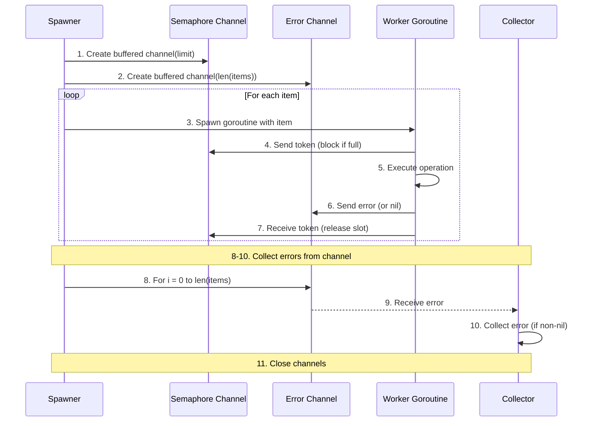

# Parallel Execution Algorithm

**Used by**:

- [Parallel Execution Feature](../features/05-parallel-execution.md)
- [Merger System](../features/03-merger-system.md)

## Overview

The parallel execution algorithm uses Go channels as semaphores to limit concurrent operations. It spawns goroutines for each item (processors, plugins, containers) but uses a buffered channel to ensure only `n` operations run simultaneously, where `n` is the CPU count.

This prevents resource exhaustion while maximizing CPU utilization during container starts, pulls, and HTTP calls to processors.

## Input/Output

| Input              | Type            | Description                                    |
| ------------------ | --------------- | ---------------------------------------------- |
| `items`            | `[]T`           | Items to process (processors, plugins, etc.)   |
| `parallelismLimit` | `int`           | Max concurrent operations (usually `NumCPU()`) |
| `operation`        | `func(T) error` | Function to execute for each item              |

| Output   | Type      | Description                                            |
| -------- | --------- | ------------------------------------------------------ |
| `errors` | `[]error` | Errors from failed operations (empty if all succeeded) |

## Steps



| #   | Step                 | What                                          | Why                             | Key File          |
| --- | -------------------- | --------------------------------------------- | ------------------------------- | ----------------- |
| 1   | Create semaphore     | Buffered channel with size = parallelismLimit | Limit concurrent goroutines     | `executor.go:98`  |
| 2   | Create error channel | Buffered channel with size = len(items)       | Collect errors without blocking | `executor.go:97`  |
| 3   | Spawn goroutine      | Launch worker for each item                   | Execute operations concurrently | `executor.go:106` |
| 4   | Acquire              | Send to semaphore channel (blocks if full)    | Wait for available slot         | `executor.go:101` |
| 5   | Execute              | Run the operation function                    | Do the actual work              | `executor.go:113` |
| 6   | Report               | Send error to error channel                   | Return operation result         | `executor.go:116` |
| 7   | Release              | Receive from semaphore channel                | Free slot for next goroutine    | `executor.go:117` |
| 8   | Wait                 | Loop len(items) times                         | Ensure all goroutines finish    | `executor.go:137` |
| 9   | Collect              | Receive from error channel                    | Gather operation results        | `executor.go:138` |
| 10  | Accumulate           | Append non-nil errors to slice                | Build error list                | `executor.go:139` |
| 11  | Close                | Close all channels                            | Free resources                  | `executor.go:149` |

## Detailed Walkthrough

### Step 1-2: Channel Setup

**Key File**: `executor.go:97` → `startProcessors()`

```go
semaphore := make(chan int, parallelismLimit)  // Buffer = limit
errChan := make(chan error, len(processors))  // Buffer = item count
```

The semaphore channel controls concurrency. When the buffer is full, sends block.

### Step 3-7: Worker Goroutine

**Key File**: `executor.go:106` → `startProcessors()` goroutine

Each worker:

1. Sends to semaphore to acquire a slot (blocks if limit reached)
2. Executes the operation (e.g., start container)
3. Sends error (or nil) to error channel
4. Receives from semaphore to release the slot

```go
go func(container DockerContainerReference, image DockerImageReference) {
    semaphore <- 0                              // Acquire
    err := e.Docker.CreateContainerWithReadWriteVolume(...)
    errChan <- err                              // Report
    <-semaphore                                // Release
}(c, i)
```

### Step 8-11: Collection

**Key File**: `executor.go:137` → `startProcessors()` collection loop

The main goroutine waits for all workers by receiving from the error channel exactly len(items) times.

## Container Starts

**Key File**: `executor.go:93` → `startProcessors()`

Used for starting multiple processor containers concurrently:

- Spawns goroutine for each processor
- Creates container with two-volume mount
- Performs health check on port 5551
- Collects all errors before returning

## HTTP Calls to Processors

**Key File**: `merger.go:102` → `execProcessors()`

Used for calling processor APIs during merge:

- Spawns goroutine for each processor
- POSTs to `http://container:5551/api/process`
- Collects output directories and errors

## Image Pulls

**Key File**: `docker.go:69` → `PullImages()`

Used for pulling multiple Docker images concurrently:

- Spawns goroutine for each image
- Streams pull progress to stdout
- Collects errors

## Container Removal

**Key File**: `docker.go:243` → `RemoveAllContainers()`

Used for removing multiple containers concurrently:

- Spawns goroutine for each container
- Calls `ContainerRemove` with force flag
- Collects errors

## Edge Cases

| Case              | Input                      | Behavior                               | Key File          |
| ----------------- | -------------------------- | -------------------------------------- | ----------------- |
| All items succeed | 5 processors, all start OK | Returns empty error slice              | `executor.go:143` |
| Some items fail   | 5 processors, 2 fail       | Returns slice with 2 errors            | `executor.go:139` |
| All items fail    | 5 processors, all fail     | Returns slice with 5 errors            | `executor.go:143` |
| Zero items        | Empty processor list       | Returns immediately with no errors     | `executor.go:137` |
| Single item       | 1 processor                | Executes without blocking on semaphore | `executor.go:101` |

## Error Handling

| Error                    | Cause                                     | Handling                                      |
| ------------------------ | ----------------------------------------- | --------------------------------------------- |
| Container creation fails | Docker API error or invalid image         | Collected in error slice, execution continues |
| Health check timeout     | Container doesn't start within 60s        | Collected as error in error slice             |
| HTTP call fails          | Container not responding or returns error | Collected as error in error slice             |
| Image pull fails         | Registry unreachable or image not found   | Collected as error in error slice             |

## Complexity

- **Time**: O(n/p + p) where n = items, p = parallelism limit
- **Space**: O(p) for semaphore, O(n) for error channel

## Related

- [Parallel Execution Feature](../features/05-parallel-execution.md) - Feature-level documentation
- [Processor Isolation](../features/04-processor-isolation.md) - Uses parallel execution for container starts
- [Health Checks](../features/08-health-checks.md) - Performed after parallel container starts
