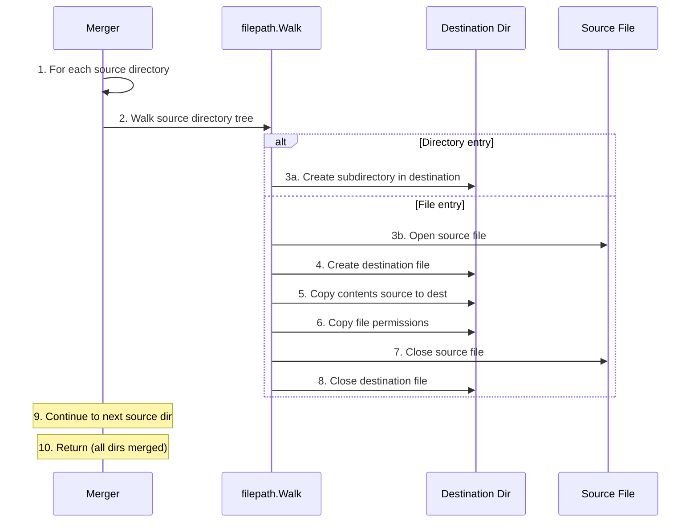

# File Merging Algorithm

**Used by**:

- [Merger System Feature](../features/03-merger-system.md)
- Merger container during merge operation

## Overview

The file merging algorithm consolidates output files from multiple processor directories into a single merged directory. It walks each source directory recursively and copies files to the destination, with later sources overwriting earlier files if there are conflicts.

This enables the 3-stage pipeline where parallel processor outputs are consolidated before plugins modify them.

## Input/Output

| Input      | Type       | Description                             |
| ---------- | ---------- | --------------------------------------- |
| `fromDirs` | `[]string` | Processor output directories to merge   |
| `toDir`    | `string`   | Destination directory for merged output |

| Output  | Type    | Description                                |
| ------- | ------- | ------------------------------------------ |
| `error` | `error` | Error if directory walk or file copy fails |

## Steps



| #   | Step     | What                                                 | Why                                   | Key File        |
| --- | -------- | ---------------------------------------------------- | ------------------------------------- | --------------- |
| 1   | Loop     | Iterate through each source directory                | Process all processor outputs         | `merger.go:264` |
| 2   | Walk     | Call `filepath.Walk` on source directory             | Traverse all files and subdirectories | `merger.go:266` |
| 3a  | Mkdir    | Create directory in destination (if directory entry) | Preserve directory structure          | `merger.go:282` |
| 3b  | Open     | Open source file for reading                         | Prepare to copy file contents         | `merger.go:24`  |
| 4   | Create   | Create destination file                              | Prepare to receive copied contents    | `merger.go:33`  |
| 5   | Copy     | Use `io.Copy` to transfer contents                   | Efficiently copy file data            | `merger.go:42`  |
| 6   | Chmod    | Copy source file permissions to destination          | Preserve file mode bits               | `merger.go:52`  |
| 7   | Close    | Close source file                                    | Free file descriptor                  | `merger.go:29`  |
| 8   | Close    | Close destination file                               | Flush and free file descriptor        | `merger.go:38`  |
| 9   | Continue | Proceed to next source directory                     | Merge all processor outputs           | `merger.go:265` |
| 10  | Return   | Return nil error (or first error encountered)        | Signal completion                     | `merger.go:292` |

## Detailed Walkthrough

### Step 1-2: Directory Walk

**Key File**: `merger.go:264` → `MergeFiles()`

For each source directory, `filepath.Walk` is called with a callback function that processes each path:

```go
for _, dir := range fromDirs {
    err := filepath.Walk(dir, func(path string, info os.FileInfo, err error) error {
        // Process each entry
    })
}
```

### Step 3a: Directory Creation

**Key File**: `merger.go:280` → directory handling

When a directory entry is encountered:

1. Calculate relative path from source root
2. Create corresponding path in destination
3. Copy directory permissions

```go
if info.IsDir() {
    return os.MkdirAll(destPath, info.Mode())
}
```

### Step 3b-8: File Copy

**Key File**: `merger.go:22` → `copyFile()`

When a file entry is encountered:

1. Open source file
2. Create destination file
3. Copy contents with `io.Copy`
4. Copy permissions with `os.Chmod`
5. Close both files

### Conflict Resolution

**Key File**: `merger.go:265` → loop order

Later source directories overwrite earlier ones. If `fromDirs = ["dir1", "dir2"]` and both contain `config.json`, the version from `dir2` wins.

## Usage Context

### Merger Container

**Key File**: `server.go:503` → `/merge/:sessionId` endpoint

The merger container runs Boron itself and exposes the `MergeFiles` function via HTTP:

1. Coordinator calls `http://merger:9000/merge/sessionId`
2. Merger container calls `MergeFiles()` internally
3. Returns OK when merge completes

### 3-Stage Pipeline

**Key File**: `merger.go:296` → `Merge()`

The file merge is stage 2 of the 3-stage pipeline:

1. **Stage 1**: Processors output to unique directories
2. **Stage 2**: File merge consolidates outputs
3. **Stage 3**: Plugins process merged directory

## Edge Cases

| Case               | Input                      | Behavior                                  | Key File        |
| ------------------ | -------------------------- | ----------------------------------------- | --------------- |
| Empty source list  | `fromDirs = []`            | Returns immediately with no error         | `merger.go:265` |
| Empty directory    | `fromDirs = ["empty/"]`    | Creates no files in destination           | `merger.go:266` |
| Overwrite conflict | Two dirs have same file    | Later source overwrites earlier           | `merger.go:284` |
| Nested directories | Deep source directory tree | Preserves full directory structure        | `merger.go:272` |
| Symlinks           | Source contains symlinks   | Copies symlink target, not symlink itself | `merger.go:24`  |

## Error Handling

| Error               | Cause                                   | Handling                            |
| ------------------- | --------------------------------------- | ----------------------------------- |
| Source not found    | Directory in `fromDirs` doesn't exist   | Returns error from `filepath.Walk`  |
| Permission denied   | Cannot read source or write destination | Returns error from file operations  |
| Disk full           | Cannot write to destination             | Returns error from file creation    |
| Walk callback error | Any error during processing             | Returns immediately, stopping merge |

## Complexity

- **Time**: O(n) where n = total files across all source directories
- **Space**: O(1) additional (streams file contents)

## Related

- [Merger System Feature](../features/03-merger-system.md) - Feature-level documentation
- [Processor Isolation](../features/04-processor-isolation.md) - Creates the source directories to merge
- [Plugin Lifecycle](../features/06-plugin-lifecycle.md) - Processes the merged output
