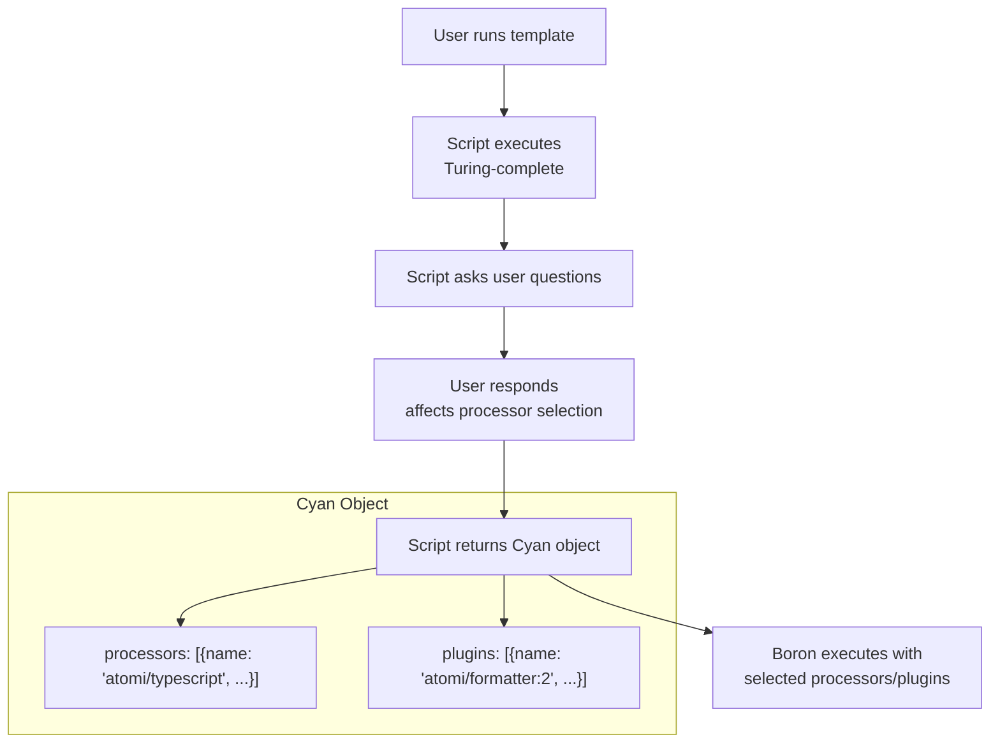
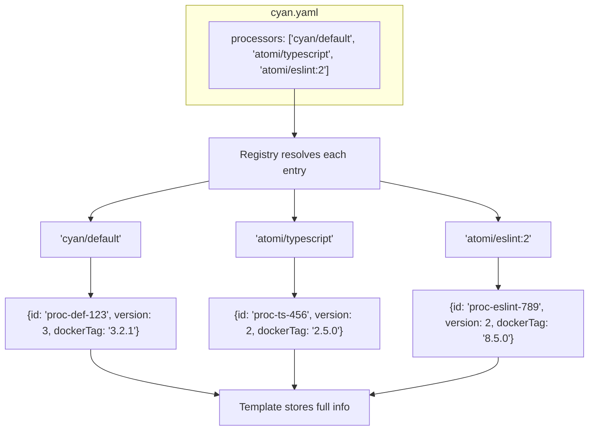

# Template's Processor vs Cyan Processor

## Overview

Boron uses two separate processor lists that serve different purposes. Understanding why both exist is key to understanding the system's design.

**Note:** This applies to processors, plugins, and child templates - all follow the same pattern.

## The Template Artifact

A template artifact contains:

- **Script** - A Turing-complete script that asks users questions and generates a build plan
- **cyan.yaml** - Template metadata

```text
template/
├── script          # User-provided, asks questions, returns Cyan object
└── cyan.yaml       # Template metadata
```

**Template Artifact Resolution**: When a template is pushed to the Zinc registry, the registry resolves all processor, plugin, and template references in `cyan.yaml` to their fully-pinned versions. This includes:

- Resolving `username/name` to the latest version
- Resolving `username/name:version` to the specific version
- Storing the complete processor/plugin metadata (ID, version, Docker reference, Docker tag)

This "push-time pinning" ensures reproducibility - the same template version always uses the same processor versions.

## cyan.yaml Format

**What the author writes:**

```yaml
username: atomi
name: shared
description: All shared files across repos
project: https://github.com/AtomiCloud/shared.shared
source: https://github.com/AtomiCloud/shared.shared.git
email: admin@atomi.cloud
tags: ['atomi']
readme: cyan/README.MD
processors: ['cyan/default', 'atomi/typescript:3']
plugins: ['atomi/formatter']
templates: ['atomi/react-app']
```

**Key points:**

- Arrays of strings in `username/name` format
- Version is optional: `cyan/default` (versionless) or `atomi/typescript:3` (versioned)
- Same format for `processors`, `plugins`, and `templates`

## The Script Execution Flow



**Key insight:** The script can return different processors based on user input. We don't know ahead of time which ones will be used.

## Two Lists, Different Purposes

| Template.Processors (cyan.yaml)                             | Cyan.Processors (from script)                                                  |
| ----------------------------------------------------------- | ------------------------------------------------------------------------------ |
| **What MAY be used**                                        | **What WILL be used**                                                          |
| All processors available for this template                  | Processors to run for this specific build                                      |
| Static, defined at template creation time                   | Dynamic, determined by user script execution                                   |
| Author writes: `['cyan/default', 'atomi/typescript:3']`     | Script returns: `{name: 'atomi/typescript'}` or `{name: 'atomi/typescript:3'}` |
| Server pins to: `{id, version, dockerReference, dockerTag}` | Used with per-build config, file globs                                         |
| Used for warming/pre-downloading images                     |                                                                                |

## Push Time: Pinning Versions

When `cyan.yaml` is pushed to the registry:



**Why pin at push time?**

- **Determinism**: Same template always produces the same result
- **Reproducibility**: Builds can be reproduced later
- **Safe upgrades**: Author can bump versions by updating cyan.yaml and re-pushing

## Why Two Lists?

### 1. The Warming Problem (Performance)

The script is Turing-complete and can return different processors based on user input.

**Problem:** If we wait until the script returns to pull images, execution latency is too high.

**Solution:**

1. Template author declares all processors that **might** be used in `cyan.yaml`
2. Warm phase pulls all images from `template.processors` ahead of time
3. Execution phase runs whatever `cyan.processors` requests (already warm)

**Example:** A React template offers TypeScript or JavaScript - user chooses during script. Both images are pre-pulled during warm.

### 2. The Version Cumbersomeness Problem

Authors write simple strings, scripts can also use simple strings.

**Author's perspective:** Writing `processors: ['atomi/typescript:3']` is cumbersome. Just use `atomi/typescript`.

**Script's perspective:** Script author also doesn't want to write versions. Just return `{name: 'atomi/typescript'}`.

**Solution:** Allow versionless references, pin at push time, resolve at runtime.

### 3. The Validation Problem

Scripts are user-provided and could request anything.

**Problem:** Script could return `some/random/processor` that doesn't exist or wasn't tested.

**Solution:** Version resolution validates against the template's pinned list:

1. Script says: `atomi/typescript`
2. Registry says: Latest is v2, ID is `proc-ts-456`
3. Check: Is `proc-ts-456` in template.processors?
4. If yes → use it; if no → error

## Example Flow

**cyan.yaml (author writes):**

```yaml
processors: ['cyan/default', 'atomi/typescript']
```

**After push (template in registry):**

```json
{
  "processors": [
    {
      "id": "proc-def-123",
      "version": 3,
      "user": "cyan",
      "name": "default",
      "dockerReference": "...",
      "dockerTag": "3.2.1"
    },
    {
      "id": "proc-ts-456",
      "version": 2,
      "user": "atomi",
      "name": "typescript",
      "dockerReference": "...",
      "dockerTag": "2.5.0"
    }
  ]
}
```

**Script returns (at runtime):**

```json
{
  "processors": [{ "name": "atomi/typescript", "config": { "strict": true } }]
}
```

**Boron version resolution:**

1. Parse: `atomi/typescript` → user=`atomi`, name=`typescript`, version=`null`
2. Query registry: Get latest version of `atomi/typescript` → `{id: "proc-ts-456", version: 2}`
3. Validate: Is `proc-ts-456` in template.processors? → **Yes** ✓
4. Result: Use processor with docker image `...:2.5.0` (already pre-pulled)

## What If Script Requests Different Version?

**Script returns:**

```json
{ "name": "atomi/typescript:3" }
```

**Boron version resolution:**

1. Parse: `atomi/typescript:3` → user=`atomi`, name=`typescript`, version=`3`
2. Query registry: Get version 3 of `atomi/typescript` → `{id: "proc-ts-999", version: 3}`
3. Validate: Is `proc-ts-999` in template.processors?
4. Result: **No** ✗ → Error "processor atomi/typescript does not have a matching version defined in the template"

**Why this error?** The template only pinned version 2 (proc-ts-456). Version 3 exists in the registry but wasn't approved for this template.

## Key Takeaways

1. **cyan.yaml** = Simple string arrays: `['user/name']` or `['user/name:version']`
2. **Push time** = Registry pins each to `{id, version, dockerReference, dockerTag}`
3. **Template.Processors** = All processors that MIGHT be used (for warming)
4. **Cyan.Processors** = Processors to ACTUALLY use (from script, dynamic)
5. **Version resolution** = Script says `user/name[:version]` → registry finds ID → template validates
6. **Same pattern** for processors, plugins, and child templates
