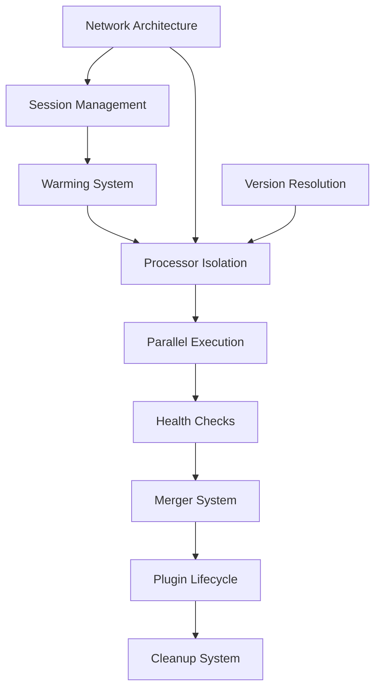

# Features Overview

Boron provides capabilities for orchestrating containerized code generation pipelines.

## Map

| Feature                  | Role                                                    |
| ------------------------ | ------------------------------------------------------- |
| **Network Architecture** | Establishes communication foundation for all containers |
| **Session Management**   | Isolates execution contexts with dedicated resources    |
| **Warming System**       | Pre-pulls images and creates volumes before execution   |
| **Version Resolution**   | Resolves processor/plugin versions from Zinc registry   |
| **Processor Isolation**  | Two-volume architecture for safe parallel execution     |
| **Parallel Execution**   | Semaphore-based concurrency control                     |
| **Health Checks**        | Ensures containers are ready before use                 |
| **Merger System**        | Consolidates processor outputs into single directory    |
| **Plugin Lifecycle**     | Sequential post-processing of merged output             |
| **Cleanup System**       | Removes session-scoped resources after execution        |

## All Features

| Feature                                              | What                                                                 | Why                                                            | Key Files                                     |
| ---------------------------------------------------- | -------------------------------------------------------------------- | -------------------------------------------------------------- | --------------------------------------------- |
| [Network Architecture](./10-network-architecture.md) | Manages `cyanprint` bridge network for inter-container communication | Enable HTTP-based container communication                      | `docker_executor/docker.go:391`               |
| [Session Management](./01-session-management.md)     | Isolates executions with session-scoped containers and volumes       | Prevent resource conflicts between concurrent executions       | `domain_model.go:42`, `executor.go:328`       |
| [Warming System](./07-warming-system.md)             | Pre-pulls images and creates template/session volumes                | Reduce latency by preparing resources ahead of execution       | `template_executor.go:282`, `executor.go:385` |
| [Version Resolution](./02-version-resolution.md)     | Queries Zinc registry to resolve processor/plugin versions           | Support version references with fallback to latest compatible  | `registry.go:147`, `registry.go:205`          |
| [Processor Isolation](./04-processor-isolation.md)   | Two-volume architecture (read-only template, read-write work area)   | Protect template integrity while enabling parallel writes      | `docker.go:328`, `executor.go:93`             |
| [Parallel Execution](./05-parallel-execution.md)     | Semaphore-based concurrent container starts and HTTP calls           | Maximize CPU utilization without resource exhaustion           | `executor.go:98`, `merger.go:102`             |
| [Health Checks](./08-health-checks.md)               | Polls HTTP endpoints until containers return 200 OK                  | Ensure containers are ready before processing                  | `executor.go:266`, `template_executor.go:251` |
| [Merger System](./03-merger-system.md)               | 3-stage pipeline: processors → merge → plugins                       | Combine parallel processor outputs before plugin modifications | `merger.go:296`, `server.go:503`              |
| [Plugin Lifecycle](./06-plugin-lifecycle.md)         | Sequential plugin execution on merged output                         | Ensure consistent, ordered post-processing                     | `merger.go:179`, `merger.go:216`              |
| [Cleanup System](./09-cleanup-system.md)             | Removes session containers and volumes after execution               | Prevent resource leaks and clean up failed executions          | `executor.go:297`, `docker.go:243`            |

## Groups

### Group 1: Infrastructure

- **[Network Architecture](./10-network-architecture.md)** - Bridge network for container communication
- **[Session Management](./01-session-management.md)** - Execution isolation

### Group 2: Preparation

- **[Warming System](./07-warming-system.md)** - Pre-pull and volume creation
- **[Version Resolution](./02-version-resolution.md)** - Registry queries

### Group 3: Execution

- **[Processor Isolation](./04-processor-isolation.md)** - Two-volume architecture
- **[Parallel Execution](./05-parallel-execution.md)** - Concurrency control
- **[Health Checks](./08-health-checks.md)** - Readiness verification

### Group 4: Pipeline

- **[Merger System](./03-merger-system.md)** - 3-stage orchestration
- **[Plugin Lifecycle](./06-plugin-lifecycle.md)** - Sequential post-processing

### Group 5: Maintenance

- **[Cleanup System](./09-cleanup-system.md)** - Resource removal
