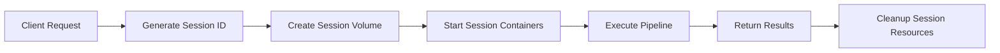
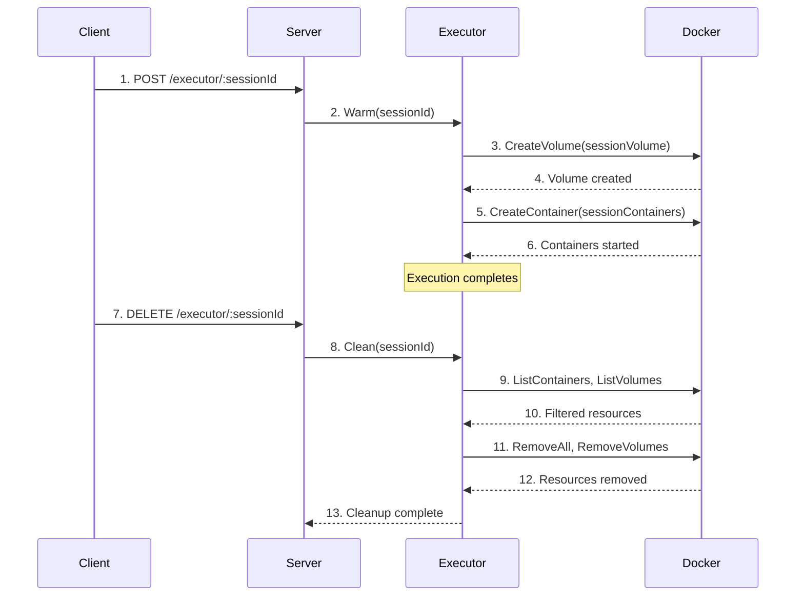

# Session Management

**What**: Isolates each execution with dedicated containers and volumes scoped to a session ID.

**Why**: Prevents resource conflicts between concurrent executions and enables cleanup of specific runs.

**Key Files**:
- `docker_executor/domain_model.go:42` → `DockerContainerReference`
- `docker_executor/domain_model.go:74` → `DockerVolumeReference`
- `docker_executor/executor.go:297` → `Clean()`

## Overview

Session management provides resource isolation for each execution. Every session gets:

1. **Session-scoped volumes** - Named `cyan-<template-uuid>-<session-id>`
2. **Session-scoped containers** - Named `cyan-<type>-<uuid>-<session-id>`
3. **Cleanup API** - Remove all resources by session ID

This allows multiple executions to run simultaneously without conflicts, and enables selective cleanup of specific runs.

## Flow

### High-Level

### Detailed

| # | Step | What | Key File |
|---|------|------|----------|
| 1 | Request | Client provides or receives session ID | `server.go:68` |
| 2 | Warm | Create session volume | `executor.go:385` |
| 3 | Create volume | Docker creates `cyan-<uuid>-<session>` | `docker.go:432` |
| 4 | Created | Volume ready for mounts | `docker.go:441` |
| 5 | Start containers | Create processor/plugin/merger containers | `executor.go:328` |
| 6 | Started | All containers running with session suffix | `docker.go:357` |
| 7 | Cleanup | Client requests cleanup | `server.go:34` |
| 8 | Clean | List and filter resources by session | `executor.go:297` |
| 9 | List | Query Docker for cyanprint resources | `docker.go:147`, `docker.go:411` |
| 10 | Filter | Return only resources matching session ID | `executor.go:306` |
| 11 | Remove | Delete containers and volumes | `docker.go:243`, `docker.go:290` |
| 12 | Removed | All session resources deleted | `docker.go:281`, `docker.go:325` |
| 13 | Complete | Return OK to client | `executor.go:325` |

## Container Naming

**Key File**: `domain_model.go:48` → `DockerContainerToString()`

Containers are named `cyan-<type>-<uuid>-<session>`:

| Type | Example | Purpose |
|------|---------|---------|
| `template` | `cyan-template-abc123-` | Template container (no session) |
| `processor` | `cyan-processor-def456-session789` | Processor container |
| `plugin` | `cyan-plugin-ghi012-session789` | Plugin container |
| `merger` | `cyan-merger-jkl345-session789` | Merger container |

**Format**: `cyan-<cyanType>-<stripped(cyanId)>-<sessionId>`

## Volume Naming

**Key File**: `domain_model.go:79` → `DockerVolumeToString()`

Volumes are named `cyan-<uuid>` or `cyan-<uuid>-<session>`:

| Volume | Name | Purpose |
|--------|------|---------|
| Template volume | `cyan-abc123` | Read-only template files (no session) |
| Session volume | `cyan-abc123-session789` | Read-write work area for a session |

**Format**: `cyan-<stripped(cyanId)>[-<sessionId>]`

## Edge Cases

- **Duplicate session ID**: If a session ID is reused, cleanup removes all containers/volumes with that ID. Client should generate unique IDs (e.g., UUID).
- **Partial cleanup**: If some containers fail to remove, errors are returned but successful removals persist. Re-run cleanup to retry.
- **Orphaned resources**: Containers/volumes without matching session ID are not affected by cleanup. Use manual Docker commands for full cleanup.

## Related

- [Network Architecture](./10-network-architecture.md) - All session containers share the `cyanprint` network
- [Cleanup System](./09-cleanup-system.md) - Detailed cleanup implementation
- [Warming System](./07-warming-system.md) - Session volume creation during warm
