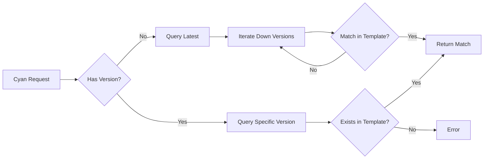
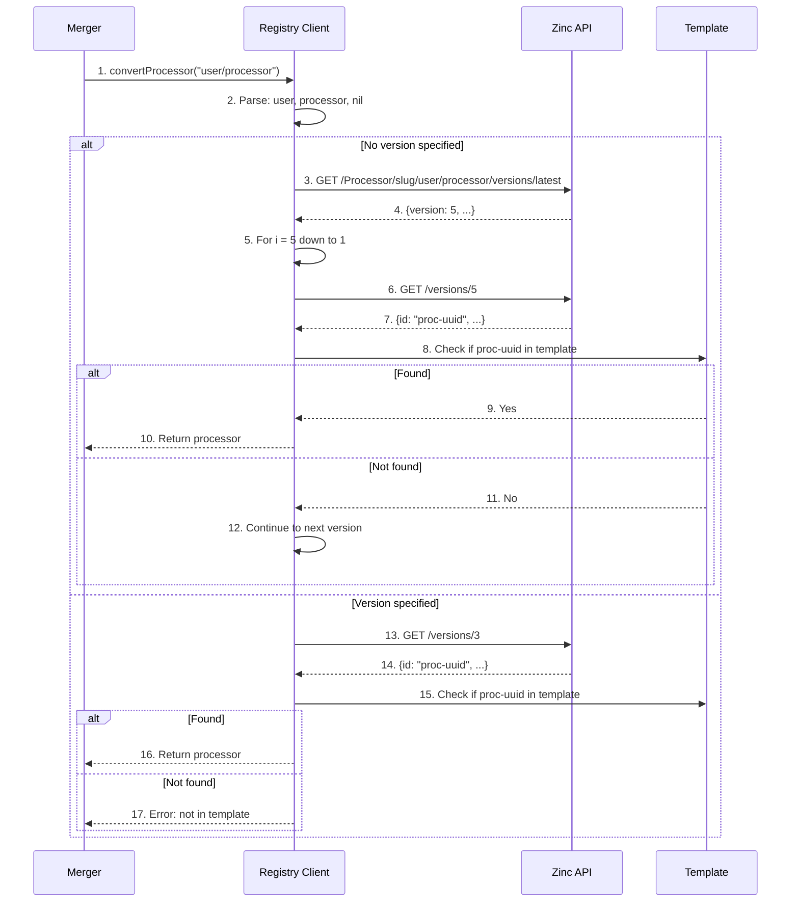

# Version Resolution

**What**: Queries the Zinc registry to resolve processor and plugin version references to concrete IDs.

**Why**: Supports flexible version references (e.g., `username/name:latest` or `username/name`) with automatic fallback to compatible versions defined in the template.

**Key Files**:
- `docker_executor/registry.go:147` → `convertProcessor()`
- `docker_executor/registry.go:205` → `convertPlugin()`
- `docker_executor/registry.go:15` → `getProcessorVersion()`

## Overview

Version resolution bridges the gap between **Cyan requests** (which reference processors/plugins by name) and **template definitions** (which specify concrete Docker images).

When a client requests processors like `{"name": "user/processor"}` or `{"name": "user/processor:3"}`, Boron:

1. Parses the reference into username, name, and optional version
2. Queries Zinc for version metadata
3. If no version specified, iterates from latest to find a match in the template
4. Returns a fully-resolved processor/plugin with ID, version, and Docker info

## Flow

### High-Level

### Detailed

| # | Step | What | Key File |
|---|------|------|----------|
| 1 | Convert | Merger calls convert with Cyan request | `merger.go:117` |
| 2 | Parse | Split reference into username, name, version | `merger.go:84` |
| 3 | Query latest | GET latest version from Zinc | `registry.go:48` |
| 4 | Latest response | Returns highest version number | `registry.go:78` |
| 5 | Iterate | Loop from latest down to 1 | `registry.go:160` |
| 6 | Query version | GET specific version from Zinc | `registry.go:15` |
| 7 | Version response | Returns processor ID and metadata | `registry.go:45` |
| 8 | Check template | Verify ID exists in template definition | `registry.go:167` |
| 9 | Match found | Template contains this processor | `registry.go:168` |
| 10 | Return | Fully resolved processor object | `registry.go:170` |
| 11 | No match | Template doesn't contain this ID | `registry.go:181` |
| 12 | Continue | Try next version down | `registry.go:160` |
| 13 | Query specific | GET exact version from Zinc | `registry.go:188` |
| 14 | Response | Returns processor for requested version | `registry.go:192` |
| 15 | Check | Verify in template | `registry.go:193` |
| 16 | Return | Resolved processor | `registry.go:193` |
| 17 | Error | Version not in template | `registry.go:201` |

## Reference Format

**Key File**: `merger.go:84` → `parseCyanReference()`

| Format | Username | Name | Version |
|--------|----------|------|---------|
| `user/name` | `user` | `name` | `nil` (resolve latest) |
| `user/name:3` | `user` | `name` | `"3"` |
| `user-org/name` | `user-org` | `name` | `nil` |

## Algorithm Details

For version resolution algorithm, see: [Version Resolution Algorithm](../algorithms/01-version-resolution.md)

## Edge Cases

| Case | Input | Behavior |
|------|-------|----------|
| Latest not in template | `user/processor` when template has v2 but latest is v5 | Iterates down from v5, finds v2 match |
| Specific version missing | `user/processor:3` when template only has v1, v2 | Error: version not in template |
| Invalid reference | `invalid-format` | Error: invalid reference format |
| Processor not in Zinc | `nonexistent/processor` | Error: registry 404 |

## Error Handling

| Error | Cause | Handling |
|-------|-------|----------|
| Invalid reference | Reference doesn't match `user/name` or `user/name:version` | Return error from `parseCyanReference` |
| Registry error | Zinc API unreachable or returns non-200 | Return HTTP error from registry call |
| No matching version | No version in template matches the resolved versions | Error: "does not have a matching version defined in the template" |

## Related

- [Merger System](./03-merger-system.md) - Uses version resolution during merge
- [Warming System](./07-warming-system.md) - Template includes version definitions
- [Version Resolution Algorithm](../algorithms/01-version-resolution.md) - Detailed implementation
