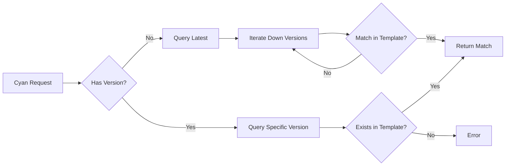

# Version Resolution

**What**: Queries the Zinc registry to resolve processor and plugin version references to concrete IDs.

**Why**: Supports flexible version references (e.g., `username/name:3` or `username/name`) with automatic fallback to compatible versions defined in the template.

**Key Files**:

- `docker_executor/registry.go:147` → `convertProcessor()`
- `docker_executor/registry.go:205` → `convertPlugin()`
- `docker_executor/registry.go:15` → `getProcessorVersion()`

## Overview

Version resolution bridges the gap between **Cyan requests** (which reference processors/plugins by name) and **template definitions** (which specify concrete Docker images).

When a client requests processors like `{"name": "user/processor"}` or `{"name": "user/processor:3"}`, Boron:

1. Parses the reference into username, name, and optional version
2. Queries Zinc for version metadata
3. If no version specified, iterates from latest to find a match in the template
4. Returns a fully-resolved processor/plugin with ID, version, and Docker info

## Flow

For detailed algorithm steps, see: [Version Resolution Algorithm](../algorithms/01-version-resolution.md)

## Reference Format

**Key File**: `merger.go:84` → `parseCyanReference()`

| Format          | Username   | Name   | Version                |
| --------------- | ---------- | ------ | ---------------------- |
| `user/name`     | `user`     | `name` | `nil` (resolve latest) |
| `user/name:3`   | `user`     | `name` | `"3"`                  |
| `user-org/name` | `user-org` | `name` | `nil`                  |

## Edge Cases

| Case                     | Input                                                  | Behavior                              |
| ------------------------ | ------------------------------------------------------ | ------------------------------------- |
| Latest not in template   | `user/processor` when template has v2 but latest is v5 | Iterates down from v5, finds v2 match |
| Specific version missing | `user/processor:3` when template only has v1, v2       | Error: version not in template        |
| Invalid reference        | `invalid-format`                                       | Error: invalid reference format       |
| Processor not in Zinc    | `nonexistent/processor`                                | Error: registry 404                   |

## Error Handling

| Error               | Cause                                                      | Handling                                                          |
| ------------------- | ---------------------------------------------------------- | ----------------------------------------------------------------- |
| Invalid reference   | Reference doesn't match `user/name` or `user/name:version` | Return error from `parseCyanReference`                            |
| Registry error      | Zinc API unreachable or returns non-200                    | Return HTTP error from registry call                              |
| No matching version | No version in template matches the resolved versions       | Error: "does not have a matching version defined in the template" |

## Related

- [Merger System](./03-merger-system.md) - Uses version resolution during merge
- [Warming System](./07-warming-system.md) - Template includes version definitions
- [Version Resolution Algorithm](../algorithms/01-version-resolution.md) - Detailed implementation
- [Template's Processor vs Cyan Processor](../concepts/template-vs-cyan-processors.md) - Why two processor lists exist
