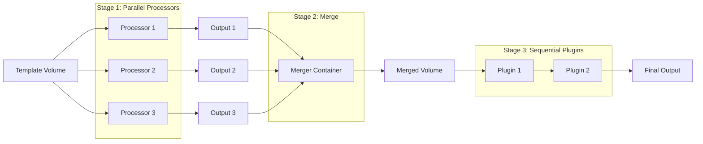
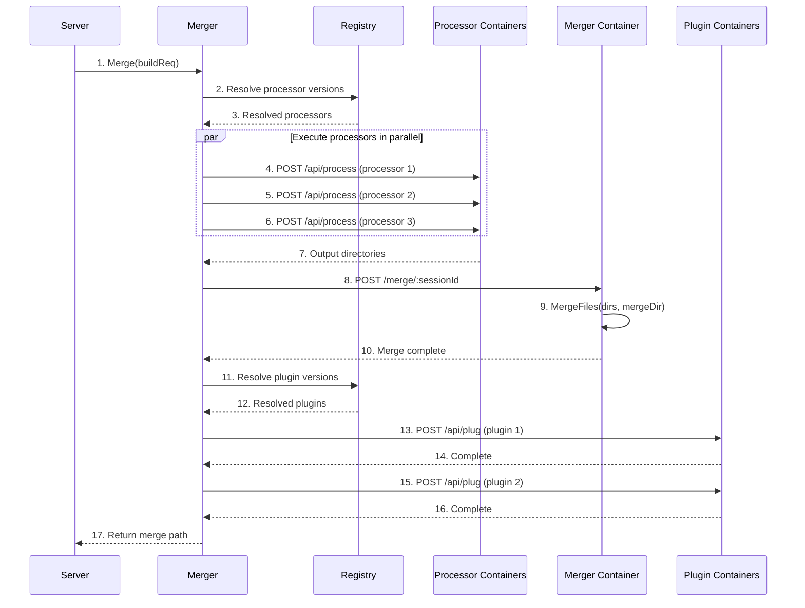

# Merger System

**What**: Orchestrates a 3-stage pipeline where processors run in parallel, outputs are merged, and plugins run sequentially.

**Why**: Maximizes parallelism for expensive transformations while ensuring plugins see a complete, consistent merged state.

**Key Files**:

- `docker_executor/merger.go:296` → `Merge()`
- `docker_executor/merger.go:102` → `execProcessors()`
- `docker_executor/merger.go:179` → `execPlugins()`

## Overview

The merger system implements a **3-stage pipeline**:

1. **Stage 1 - Processors**: Multiple processor containers run in parallel, each reading from the template volume and writing to a unique work area
2. **Stage 2 - Merge**: A merger container consolidates all processor outputs into a single merged directory
3. **Stage 3 - Plugins**: Plugin containers run sequentially, each reading and modifying the merged output

This design balances parallelism (processors) with consistency (plugins see a complete state).

## Flow

### High-Level



### Detailed



| #   | Step               | What                                      | Key File          |
| --- | ------------------ | ----------------------------------------- | ----------------- |
| 1   | Merge              | Server initiates merge with build request | `server.go:86`    |
| 2   | Resolve processors | Query Zinc for processor versions         | `merger.go:117`   |
| 3   | Resolved           | Processors with IDs, versions, configs    | `registry.go:170` |
| 4   | Call processor 1   | HTTP POST to processor container          | `merger.go:144`   |
| 5   | Call processor 2   | HTTP POST to processor container          | `merger.go:144`   |
| 6   | Call processor 3   | HTTP POST to processor container          | `merger.go:144`   |
| 7   | Outputs            | Each returns unique output directory      | `merger.go:160`   |
| 8   | Merge              | Call merger container to consolidate      | `merger.go:252`   |
| 9   | Merge files        | Walk each dir, copy to merged             | `merger.go:264`   |
| 10  | Merged             | All files in single directory             | `merger.go:292`   |
| 11  | Resolve plugins    | Query Zinc for plugin versions            | `merger.go:188`   |
| 12  | Resolved           | Plugins with IDs, versions, configs       | `registry.go:227` |
| 13  | Call plugin 1      | HTTP POST to plugin container             | `merger.go:223`   |
| 14  | Complete           | Plugin 1 done                             | `merger.go:233`   |
| 15  | Call plugin 2      | HTTP POST to plugin container             | `merger.go:223`   |
| 16  | Complete           | Plugin 2 done                             | `merger.go:233`   |
| 17  | Return             | Path to merged output                     | `merger.go:329`   |

## Processor Execution

**Key File**: `merger.go:102` → `execProcessors()`

Each processor receives:

```json
{
  "readDir": "/workspace/cyanprint",
  "writeDir": "/workspace/area/<uuid>",
  "globs": [{ "glob": "**/*.go" }],
  "config": { ... }
}
```

Processor responds with output directory used for merging.

## Merge Operation

**Key File**: `merger.go:264` → `MergeFiles()`

The merger container:

1. Walks each processor output directory
2. Copies files to the merged directory
3. Later files overwrite earlier files (last write wins)
4. Runs inside a container for isolation

## Plugin Execution

**Key File**: `merger.go:179` → `execPlugins()`

Each plugin receives:

```json
{
  "directory": "/workspace/area/<merge-uuid>",
  "config": { ... }
}
```

Plugins run **sequentially** - plugin 2 sees the result of plugin 1.

## Algorithm Details

For detailed implementation, see:

- [Parallel Execution Algorithm](../algorithms/02-parallel-execution.md) - Processor concurrency
- [File Merging Algorithm](../algorithms/03-file-merging.md) - Merge logic

## Edge Cases

| Case            | Behavior                                               |
| --------------- | ------------------------------------------------------ |
| No processors   | Returns empty merge path, plugins run on template only |
| No plugins      | Merge completes without post-processing                |
| Processor fails | Returns error from that processor, stops merge         |
| Plugin fails    | Returns error from that plugin, partial merge exists   |
| Duplicate files | Last write wins (later processor overwrites earlier)   |

## Related

- [Processor Isolation](./04-processor-isolation.md) - Two-volume architecture for processors
- [Parallel Execution](./05-parallel-execution.md) - Semaphore-based processor parallelism
- [Plugin Lifecycle](./06-plugin-lifecycle.md) - Sequential plugin execution
