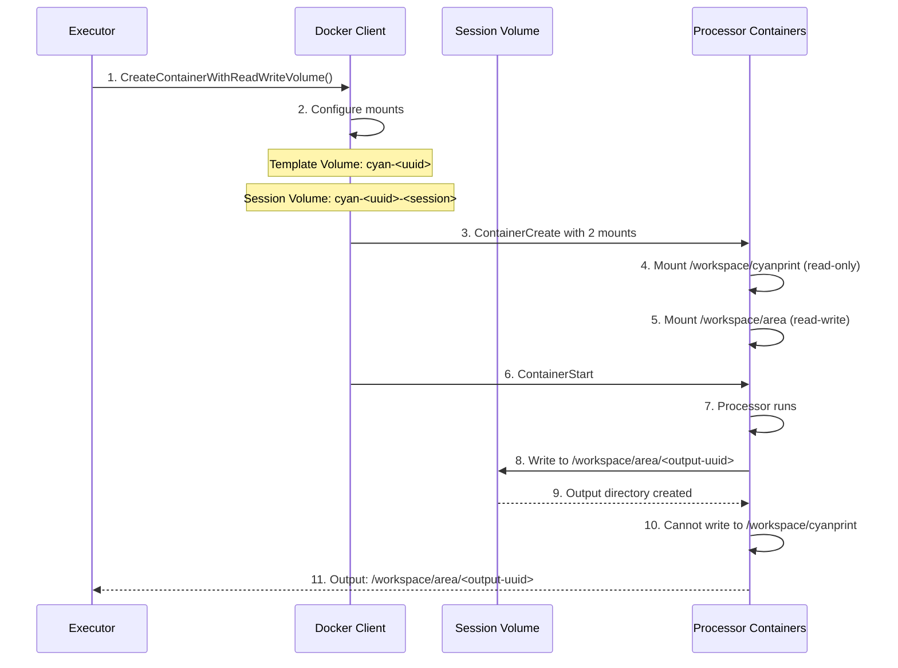

# Processor Isolation

**What**: Uses a two-volume architecture (read-only template, read-write work area) to isolate processor execution.

**Why**: Prevents processors from modifying templates while enabling safe parallel writes to isolated work areas.

**Key Files**:
- `docker_executor/docker.go:328` → `CreateContainerWithReadWriteVolume()`
- `docker_executor/executor.go:93` → `startProcessors()`

## Overview

Processor isolation ensures that:

1. **Template integrity** - Processors cannot modify the source template (read-only mount)
2. **Parallel safety** - Each processor writes to a unique UUID-based directory
3. **Clean merging** - Output directories are independent and can be safely merged

Each processor gets two volume mounts:
- `/workspace/cyanprint` - Read-only template volume
- `/workspace/area/<uuid>` - Read-write work area (unique per processor)

## Flow

### High-Level

```mermaid
flowchart LR
    subgraph Volumes[Docker Volumes]
        TV[Template Volume<br/>cyan-<template-uuid>]
        SV[Session Volume<br/>cyan-<template-uuid>-<session>]
    end

    subgraph P1[Processor 1 Container]
        M1[/workspace/cyanprint<br/>read-only]
        W1[/workspace/area/uuid-1<br/>read-write]
    end

    subgraph P2[Processor 2 Container]
        M2[/workspace/cyanprint<br/>read-only]
        W2[/workspace/area/uuid-2<br/>read-write]
    end

    TV -->|read-only| M1 & M2
    SV -->|read-write| W1 & W2
```

### Detailed



| # | Step | What | Key File |
|---|------|------|----------|
| 1 | Create container | Executor requests container with dual volumes | `executor.go:113` |
| 2 | Configure mounts | Set up read-only and read-write mounts | `docker.go:343` |
| 3 | Template volume | Mount `cyan-<uuid>` to `/workspace/cyanprint` | `docker.go:347` |
| 4 | Read-only | Template mount marked `ReadOnly: true` | `docker.go:348` |
| 5 | Session volume | Mount `cyan-<uuid>-<session>` to `/workspace/area` | `docker.go:352` |
| 6 | Read-write | Session mount marked `ReadOnly: false` | `docker.go:354` |
| 7 | Create | Docker creates container with configured mounts | `docker.go:357` |
| 8 | Start | Container starts, processor initializes | `docker.go:361` |
| 9 | Write output | Processor writes to `/workspace/area/<uuid>` | Internal to processor |
| 10 | Protected | Template cannot be modified | Enforced by Docker |
| 11 | Return | Processor returns output path for merging | `merger.go:160` |

## Volume Mount Configuration

**Key File**: `docker.go:328` → `CreateContainerWithReadWriteVolume()`

| Mount | Source | Target | Mode | Purpose |
|-------|--------|--------|------|---------|
| Template | `cyan-<template-uuid>` | `/workspace/cyanprint` | Read-only | Source files, immutable |
| Session | `cyan-<template-uuid>-<session>` | `/workspace/area` | Read-write | Output directory for all processors in session |

## Processor Output Isolation

Each processor writes to a **unique UUID-based directory** within `/workspace/area`:

```
/workspace/area/
  ├── 550e8400-e29b-41d4-a716-446655440000/  (processor 1 output)
  ├── 6ba7b810-9dad-11d1-80b4-00c04fd430c8/  (processor 2 output)
  └── 5d2b3c4d-6e7f-4a8b-9c0d-1e2f3a4b5c6d/  (processor 3 output)
```

**Key File**: `merger.go:109` → UUID generation for write path

## Edge Cases

| Case | Behavior |
|------|----------|
| Processor tries to write to template | Fails with permission error (read-only mount) |
| Two processors write same file | Each writes to separate UUID directory, no conflict |
| Processor creates many files | All contained within its UUID directory |
| Session volume full | Container write fails, error returned to caller |

## Related

- [Session Management](./01-session-management.md) - Volume naming and scoping
- [Parallel Execution](./05-parallel-execution.md) - Concurrent processor execution
- [Merger System](./03-merger-system.md) - Consolidates isolated outputs
