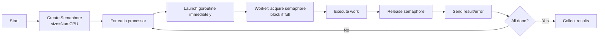

# Parallel Execution

**What**: Uses semaphore-based concurrency control to run multiple processors or plugins in parallel with CPU-based limits.

**Why**: Maximizes CPU utilization without resource exhaustion by limiting concurrent operations to the number of available cores.

**Key Files**:

- `docker_executor/executor.go:98` → `startProcessors()`
- `docker_executor/executor.go:157` → `startPlugins()`
- `docker_executor/merger.go:102` → `execProcessors()`

## Overview

Parallel execution enables multiple containers to start or be called concurrently while respecting system resources:

1. **Semaphore pattern** - Buffered channel limits active goroutines to `NumCPU()`
2. **Worker goroutines** - Each processor/plugin runs in its own goroutine
3. **Error collection** - All errors are collected and returned together
4. **Wait pattern** - Main goroutine waits for all workers to complete

This pattern is used for:

- Starting processor containers (parallel)
- Starting plugin containers (parallel)
- Calling processor APIs during merge (parallel)

## Flow

For detailed implementation, see: [Parallel Execution Algorithm](../algorithms/02-parallel-execution.md)

## Key Concepts

### Semaphore Limit

The parallelism limit is set to `runtime.NumCPU()`, ensuring the system doesn't spawn more concurrent operations than it has CPU cores to handle.

### Error Collection

All goroutine errors are collected and returned together, allowing the system to identify all failures rather than stopping at the first error.

## Edge Cases

| Case                      | Behavior                                              |
| ------------------------- | ----------------------------------------------------- |
| More processors than CPUs | Semaphore queues extra goroutines                     |
| Goroutine panic           | Panic propagates, may crash coordinator               |
| Docker timeout            | Individual goroutine gets error, collected in results |
| Single processor          | Semaphore never blocks, single goroutine runs         |

## Related

- [Processor Isolation](./04-processor-isolation.md) - Containers being started in parallel
- [Merger System](./03-merger-system.md) - Uses parallel execution for processor calls
- [Health Checks](./08-health-checks.md) - Sequential after parallel start
- [Parallel Execution Algorithm](../algorithms/02-parallel-execution.md) - Detailed implementation
