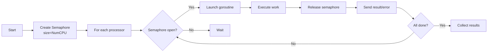
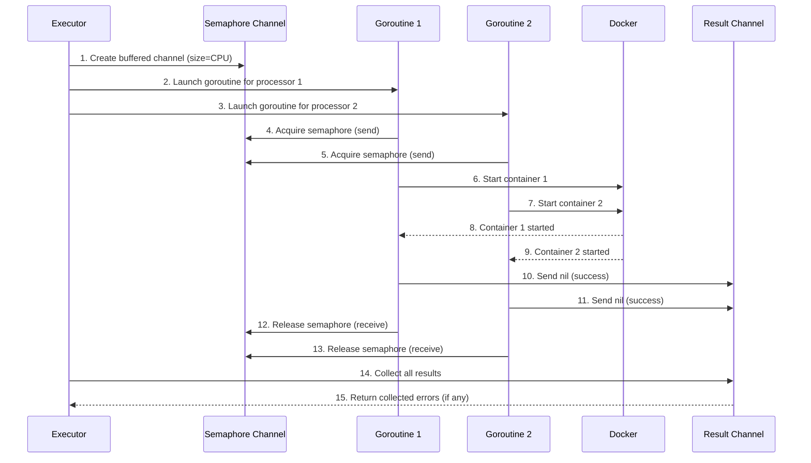

# Parallel Execution

**What**: Uses semaphore-based concurrency control to run multiple processors or plugins in parallel with CPU-based limits.

**Why**: Maximizes CPU utilization without resource exhaustion by limiting concurrent operations to the number of available cores.

**Key Files**:
- `docker_executor/executor.go:98` → `startProcessors()`
- `docker_executor/executor.go:157` → `startPlugins()`
- `docker_executor/merger.go:102` → `execProcessors()`

## Overview

Parallel execution enables multiple containers to start or be called concurrently while respecting system resources:

1. **Semaphore pattern** - Buffered channel limits active goroutines to `NumCPU()`
2. **Worker goroutines** - Each processor/plugin runs in its own goroutine
3. **Error collection** - All errors are collected and returned together
4. **Wait pattern** - Main goroutine waits for all workers to complete

This pattern is used for:
- Starting processor containers (parallel)
- Starting plugin containers (parallel)
- Calling processor APIs during merge (parallel)

## Flow

### High-Level



### Detailed



| # | Step | What | Key File |
|---|------|------|----------|
| 1 | Create semaphore | Buffered channel with size `NumCPU()` | `executor.go:98` |
| 2 | Launch goroutines | For each processor, spawn goroutine | `executor.go:100` |
| 3 | Acquire | Goroutine sends to semaphore channel | `executor.go:101` |
| 4 | Wait | If semaphore full, goroutine blocks | `executor.go:101` |
| 5 | Work | Goroutine executes (start container or API call) | `executor.go:113` |
| 6 | Release | Goroutine receives from semaphore | `executor.go:131` |
| 7 | Send result | Error sent to result channel | `executor.go:130` |
| 8 | Collect | Main goroutine collects all results | `executor.go:137` |
| 9 | Return | Combined errors returned to caller | `executor.go:150` |

## Semaphore Implementation

**Key File**: `executor.go:98` → `startProcessors()`

```go
semaphore := make(chan int, e.Docker.ParallelismLimit)

for _, processor := range processors {
    semaphore <- 0  // Acquire: blocks if full
    go func(p Processor) {
        defer func() { <-semaphore }()  // Release
        // Do work...
    }(processor)
}
```

**Limit**: `ParallelismLimit = runtime.NumCPU()`

## Error Collection

All goroutine errors are collected and returned together:

```go
errChan := make(chan error, len(processors))
// ...goroutines send errors to errChan...
var allErr []error
for i := 0; i < len(processors); i++ {
    err := <-errChan
    if err != nil {
        allErr = append(allErr, err)
    }
}
return allErr
```

## Algorithm Details

For detailed implementation, see: [Parallel Execution Algorithm](../algorithms/02-parallel-execution.md)

## Edge Cases

| Case | Behavior |
|------|----------|
| More processors than CPUs | Semaphore queues extra goroutines |
| Goroutine panic | Panic propagates, may crash coordinator |
| Docker timeout | Individual goroutine gets error, collected in results |
| Single processor | Semaphore never blocks, single goroutine runs |

## Related

- [Processor Isolation](./04-processor-isolation.md) - Containers being started in parallel
- [Merger System](./03-merger-system.md) - Uses parallel execution for processor calls
- [Health Checks](./08-health-checks.md) - Sequential after parallel start
