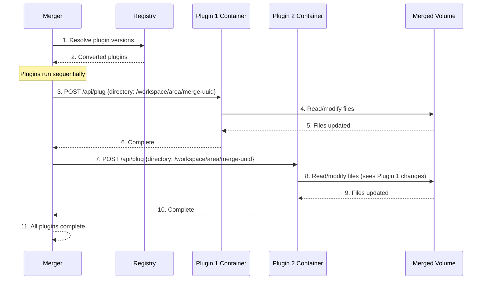

# Plugin Lifecycle

**What**: Executes plugins sequentially on the merged output directory.

**Why**: Ensures plugins see a consistent, complete state and enables ordered transformations (e.g., formatter then linter).

**Key Files**:

- `docker_executor/merger.go:179` → `execPlugins()`
- `docker_executor/merger.go:216` → Sequential plugin loop

## Overview

Unlike processors which run in parallel, **plugins run sequentially**:

1. **Version resolution** - Query Zinc for plugin version metadata
2. **Sequential execution** - Each plugin runs after the previous completes
3. **Shared directory** - All plugins operate on the same merged output
4. **Cumulative changes** - Plugin 2 sees the result of Plugin 1

This ensures ordered transformations and prevents race conditions.

## Flow

### High-Level


### Detailed



| #   | Step          | What                                 | Key File           |
| --- | ------------- | ------------------------------------ | ------------------ |
| 1   | Resolve       | Query Zinc for plugin versions       | `merger.go:188`    |
| 2   | Converted     | Plugins with IDs, versions, configs  | `registry.go:227`  |
| 3   | Call plugin 1 | HTTP POST to plugin container        | `merger.go:223`    |
| 4   | Modify        | Plugin reads/writes merged directory | Internal to plugin |
| 5   | Updated       | Files changed by plugin 1            | Internal to plugin |
| 6   | Complete      | Plugin 1 returns success             | `merger.go:233`    |
| 7   | Call plugin 2 | HTTP POST to plugin container        | `merger.go:223`    |
| 8   | Modify        | Plugin 2 sees plugin 1 changes       | Internal to plugin |
| 9   | Updated       | Files changed by plugin 2            | Internal to plugin |
| 10  | Complete      | Plugin 2 returns success             | `merger.go:233`    |
| 11  | Return        | All plugins complete, return nil     | `merger.go:235`    |

## Plugin Request Format

**Key File**: `merger.go:225` → Plugin POST request

```json
{
  "directory": "/workspace/area/<merge-uuid>",
  "config": { ...plugin config... }
}
```

Each plugin:

1. Reads files from the shared directory
2. Modifies them in-place
3. Returns when complete

## Sequential Execution

**Key File**: `merger.go:216` → Sequential plugin loop

```go
for _, plugin := range convertedPlugins {
    endpoint := fmt.Sprintf("http://%s:5552/api/plug", containerName)
    _, err := PostJSON[Req, Res](endpoint, req)
    if err != nil {
        return []error{err}  // Stop on first error
    }
}
```

Note: **No goroutines** - plugins run one at a time.

## Container Health Check

Before plugins run, plugin containers are health-checked:

**Key File**: `executor.go:182` → Plugin status check on port 5552

```go
ep := "http://" + DockerContainerToString(c) + ":5552"
err = e.statusCheck(ep, 60)
```

## Edge Cases

| Case                      | Behavior                                                  |
| ------------------------- | --------------------------------------------------------- |
| Plugin fails              | Stops immediately, returns error, partial changes persist |
| No plugins                | Skips plugin stage, returns merged output                 |
| Plugin modifies same file | Later plugin sees earlier plugin's changes                |
| Plugin creates new files  | Later plugin can see and modify them                      |

## Related

- [Merger System](./03-merger-system.md) - Plugins run after merge stage
- [Processor Isolation](./04-processor-isolation.md) - Processors are parallel, plugins are sequential
- [Health Checks](./08-health-checks.md) - Plugin containers health-checked before use
