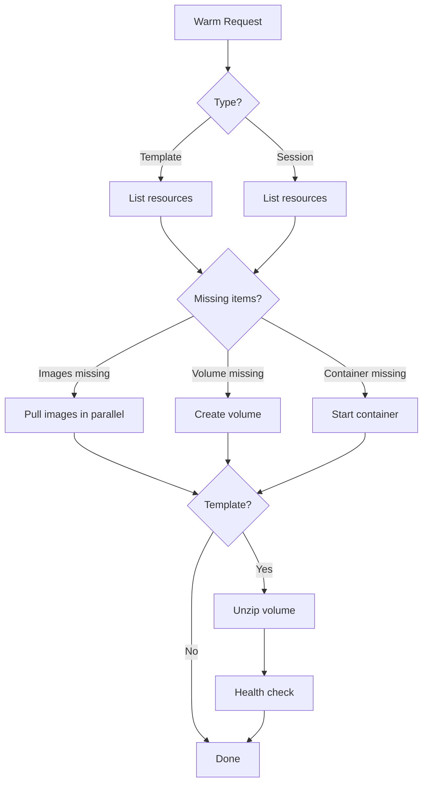
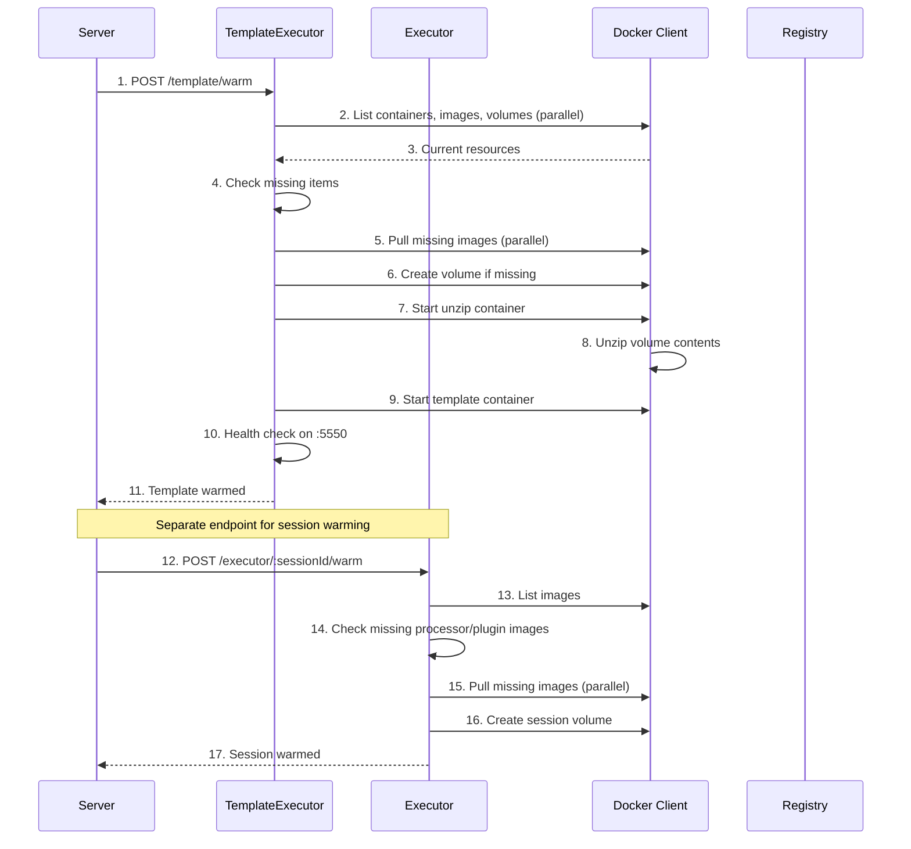

# Warming System

**What**: Pre-pulls Docker images and creates volumes before execution to reduce latency.

**Why**: Eliminates image pull time during execution and ensures volumes are ready when containers start.

**Key Files**:

- `docker_executor/template_executor.go:282` → `WarmTemplate()`
- `docker_executor/executor.go:385` → `Warm()`

## Overview

The warming system prepares resources ahead of execution:

1. **Template warming** - Pre-pull template images, create template volume and container
2. **Session warming** - Pre-pull processor/plugin images, create session volume

Warming happens via two endpoints:

- `POST /template/warm` - Warm a template (shared across sessions)
- `POST /executor/:sessionId/warm` - Warm a session (specific to one execution)

## Flow

### High-Level



### Detailed



| #   | Step               | What                                         | Key File                   |
| --- | ------------------ | -------------------------------------------- | -------------------------- |
| 1   | Warm template      | Server receives warm request                 | `server.go:312`            |
| 2   | List resources     | Query Docker for current state               | `template_executor.go:74`  |
| 3   | Current state      | Return containers, images, volumes           | `template_executor.go:143` |
| 4   | Check missing      | Identify what needs to be created            | `template_executor.go:292` |
| 5   | Pull images        | Download missing template images             | `template_executor.go:325` |
| 6   | Create volume      | Create template volume if missing            | `template_executor.go:161` |
| 7   | Unzip container    | Start container to unzip volume              | `template_executor.go:181` |
| 8   | Unzipped           | Volume populated with template files         | `template_executor.go:188` |
| 9   | Template container | Start template API container                 | `template_executor.go:146` |
| 10  | Health check       | Poll :5550 until 200 OK                      | `template_executor.go:338` |
| 11  | Warmed             | Template ready for use                       | `template_executor.go:344` |
| 12  | Warm session       | Server receives session warm request         | `server.go:248`            |
| 13  | List images        | Query local images                           | `executor.go:388`          |
| 14  | Check missing      | Identify processor/plugin images not present | `executor.go:396`          |
| 15  | Pull images        | Download missing images in parallel          | `executor.go:407`          |
| 16  | Create volume      | Create session-scoped volume                 | `executor.go:428`          |
| 17  | Warmed             | Session ready for execution                  | `executor.go:450`          |

## Template Warming

**Key File**: `template_executor.go:282` → `WarmTemplate()`

Prepares shared template resources:

| Resource           | Name                          | Purpose                  |
| ------------------ | ----------------------------- | ------------------------ |
| Template image     | `templateDockerReference:tag` | Template API container   |
| Blob image         | `blobDockerReference:tag`     | Volume initialization    |
| Template volume    | `cyan-<template-uuid>`        | Read-only template files |
| Template container | `cyan-template-<uuid>`        | Template API server      |

**Unzip process**: A "volume" container temporarily mounts the volume and extracts files from the blob image, then is removed.

## Session Warming

**Key File**: `executor.go:385` → `Warm()`

Prepares session-specific resources:

| Resource         | Name                             | Purpose              |
| ---------------- | -------------------------------- | -------------------- |
| Processor images | Various Docker references        | Processor containers |
| Plugin images    | Various Docker references        | Plugin containers    |
| Session volume   | `cyan-<template-uuid>-<session>` | Read-write work area |

## Parallel Pulling

Both template and session warming use parallel image pulls:

**Key File**: `docker.go:69` → `PullImages()`

```go
semaphore := make(chan int, d.ParallelismLimit)
for _, image := range images {
    go func(img Image) {
        semaphore <- 0  // Acquire
        d.Docker.ImagePull(ctx, ref, opts)
        <-semaphore  // Release
    }(image)
}
```

## Edge Cases

| Case                             | Behavior                                           |
| -------------------------------- | -------------------------------------------------- |
| Template already warmed          | Skips image pull, volume creation, container start |
| Volume exists, container missing | Creates container only                             |
| Container exists, volume missing | Recreates volume and container                     |
| Network missing                  | Auto-creates `cyanprint` network                   |
| Image pull fails                 | Returns error, partial resources may exist         |

## Related

- [Network Architecture](./10-network-architecture.md) - Network created during warm
- [Session Management](./01-session-management.md) - Session volume naming
- [Health Checks](./08-health-checks.md) - Template container health check
