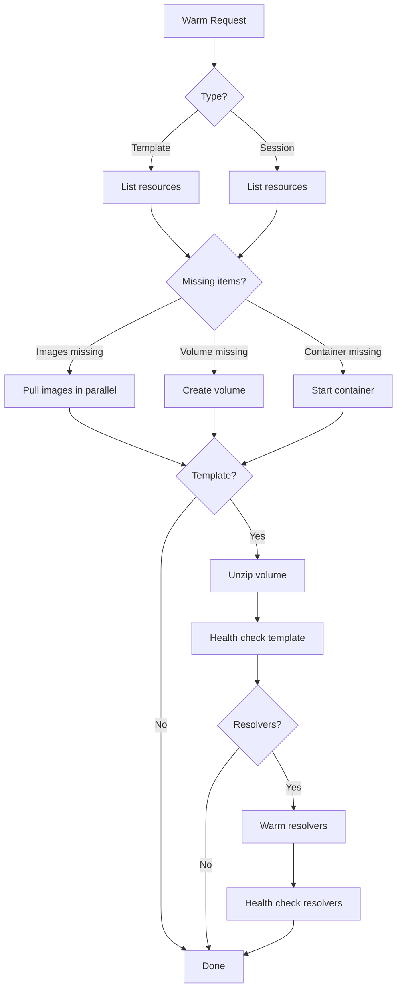
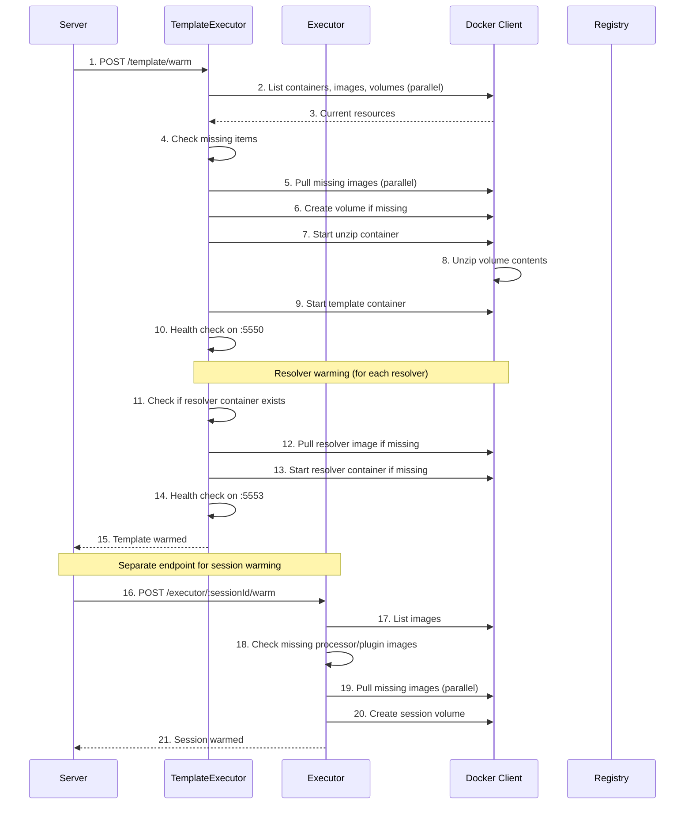

# Warming System

**What**: Pre-pulls Docker images and creates volumes before execution to reduce latency.

**Why**: Eliminates image pull time during execution and ensures volumes are ready when containers start.

**Key Files**:

- `docker_executor/template_executor.go:282` → `WarmTemplate()`
- `docker_executor/executor.go:385` → `Warm()`

## Overview

The warming system prepares resources ahead of execution:

1. **Template warming** - Pre-pull template images, create template volume and container
2. **Resolver warming** - Pre-pull resolver images, create resolver containers
3. **Session warming** - Pre-pull processor/plugin images, create session volume

Warming happens via two endpoints:

- `POST /template/warm` - Warm a template (shared across sessions)
- `POST /executor/:sessionId/warm` - Warm a session (specific to one execution)

## Flow

### High-Level


```mermaid
flowchart TD
    A[Warm Request] --> B{Type?}
    B -->|Template| C[List resources]
    B -->|Session| D[List resources]

    C --> E{Missing items?}
    D --> E

    E -->|Images missing| F[Pull images in parallel]
    E -->|Volume missing| G[Create volume]
    E -->|Container missing| H[Start container]

    F --> I{Template?}
    G --> I
    H --> I

    I -->|Yes| J[Unzip volume]
    I -->|No| K[Done]
    J --> L[Health check template]
    L --> M{Resolvers?}
    M -->|Yes| N[Warm resolvers]
    M -->|No| K
    N --> O[Health check resolvers]
    O --> K
```

### Detailed


```mermaid
sequenceDiagram
    participant S as Server
    participant TE as TemplateExecutor
    participant E as Executor
    participant D as Docker Client
    participant R as Registry

    S->>TE: 1. POST /template/warm
    TE->>D: 2. List containers, images, volumes (parallel)
    D-->>TE: 3. Current resources

    TE->>TE: 4. Check missing items
    TE->>D: 5. Pull missing images (parallel)
    TE->>D: 6. Create volume if missing
    TE->>D: 7. Start unzip container
    D->>D: 8. Unzip volume contents
    TE->>D: 9. Start template container
    TE->>TE: 10. Health check on :5550

    Note over TE,D: Resolver warming (for each resolver)
    TE->>TE: 11. Check if resolver container exists
    TE->>D: 12. Pull resolver image if missing
    TE->>D: 13. Start resolver container if missing
    TE->>TE: 14. Health check on :5553

    TE-->>S: 15. Template warmed

    Note over S,E: Separate endpoint for session warming

    S->>E: 16. POST /executor/:sessionId/warm
    E->>D: 17. List images
    E->>E: 18. Check missing processor/plugin images
    E->>D: 19. Pull missing images (parallel)
    E->>D: 20. Create session volume
    E-->>S: 21. Session warmed
```

| #   | Step               | What                                         | Key File                   |
| --- | ------------------ | -------------------------------------------- | -------------------------- |
| 1   | Warm template      | Server receives warm request                 | `server.go:312`            |
| 2   | List resources     | Query Docker for current state               | `template_executor.go:74`  |
| 3   | Current state      | Return containers, images, volumes           | `template_executor.go:143` |
| 4   | Check missing      | Identify what needs to be created            | `template_executor.go:292` |
| 5   | Pull images        | Download missing template images             | `template_executor.go:325` |
| 6   | Create volume      | Create template volume if missing            | `template_executor.go:161` |
| 7   | Unzip container    | Start container to unzip volume              | `template_executor.go:181` |
| 8   | Unzipped           | Volume populated with template files         | `template_executor.go:188` |
| 9   | Template container | Start template API container                 | `template_executor.go:146` |
| 10  | Health check       | Poll :5550 until 200 OK                      | `template_executor.go:338` |
| 11  | Check resolver     | Check if resolver container exists           | `template_executor.go:75`  |
| 12  | Pull resolver      | Pull resolver image if missing               | `template_executor.go:401` |
| 13  | Start resolver     | Start resolver container if missing          | `template_executor.go:408` |
| 14  | Resolver health    | Poll :5553 until 200 OK                      | `template_executor.go:420` |
| 15  | Warmed             | Template ready for use                       | `template_executor.go:428` |
| 16  | Warm session       | Server receives session warm request         | `server.go:248`            |
| 17  | List images        | Query local images                           | `executor.go:388`          |
| 18  | Check missing      | Identify processor/plugin images not present | `executor.go:396`          |
| 19  | Pull images        | Download missing images in parallel          | `executor.go:407`          |
| 20  | Create volume      | Create session-scoped volume                 | `executor.go:428`          |
| 21  | Warmed             | Session ready for execution                  | `executor.go:450`          |

## Template Warming

**Key File**: `template_executor.go:282` → `WarmTemplate()`

Prepares shared template resources:

| Resource           | Name                          | Purpose                  |
| ------------------ | ----------------------------- | ------------------------ |
| Template image     | `templateDockerReference:tag` | Template API container   |
| Blob image         | `blobDockerReference:tag`     | Volume initialization    |
| Template volume    | `cyan-<template-uuid>`        | Read-only template files |
| Template container | `cyan-template-<uuid>`        | Template API server      |

**Unzip process**: A "volume" container temporarily mounts the volume and extracts files from the blob image, then is removed.

## Resolver Warming

**Key File**: `template_executor.go:282` → `WarmTemplate()` (resolver warming happens after template warming)

Prepares resolver containers for use during template execution:

| Resource           | Name                        | Purpose             |
| ------------------ | --------------------------- | ------------------- |
| Resolver image     | `dockerReference:dockerTag` | Resolver container  |
| Resolver container | `cyan-resolver-<uuid>`      | Resolver API server |

Resolver warming happens as part of template warming, after the template container health check succeeds. Each resolver is:

1. Checked for existing container
2. Image pulled if missing
3. Container started if missing
4. Health checked on port 5553

## Session Warming

**Key File**: `executor.go:385` → `Warm()`

Prepares session-specific resources:

| Resource         | Name                             | Purpose              |
| ---------------- | -------------------------------- | -------------------- |
| Processor images | Various Docker references        | Processor containers |
| Plugin images    | Various Docker references        | Plugin containers    |
| Session volume   | `cyan-<template-uuid>-<session>` | Read-write work area |

## Parallel Pulling

Both template and session warming use parallel image pulls:

**Key File**: `docker.go:69` → `PullImages()`

```go
semaphore := make(chan int, d.ParallelismLimit)
wg := sync.WaitGroup{}
for _, image := range images {
    wg.Add(1)
    go func(img Image) {
        defer wg.Done()
        defer func() { <-semaphore }()  // Release on exit
        semaphore <- 0  // Acquire
        d.Docker.ImagePull(ctx, img.Ref, opts)
    }(image)
}
wg.Wait()
```

## Edge Cases

| Case                             | Behavior                                           |
| -------------------------------- | -------------------------------------------------- |
| Template already warmed          | Skips image pull, volume creation, container start |
| Volume exists, container missing | Creates container only                             |
| Container exists, volume missing | Recreates volume and container                     |
| Network missing                  | Auto-creates `cyanprint` network                   |
| Image pull fails                 | Returns error, partial resources may exist         |
| Empty resolvers slice            | No resolver warming needed, continues normally     |
| Resolver already running         | Idempotent, skips container creation               |
| Resolver image pull fails        | Returns error, fails entire warm request           |
| Resolver health check times out  | Returns error, fails entire warm request           |
| Multiple resolvers               | Warms all sequentially, fails if any fail          |

## Related

- [Network Architecture](./10-network-architecture.md) - Network created during warm
- [Session Management](./01-session-management.md) - Session volume naming
- [Health Checks](./08-health-checks.md) - Template container health check
