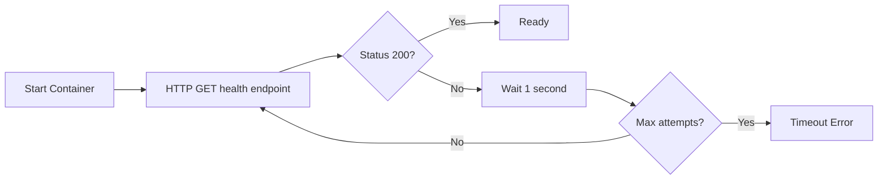
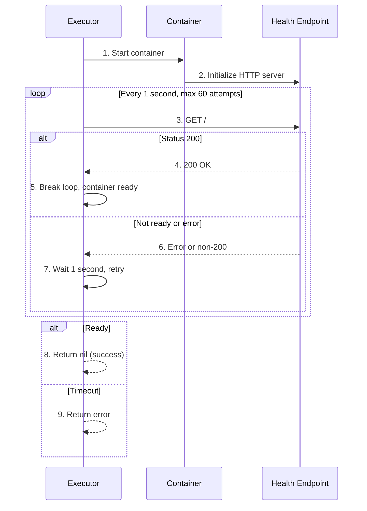

# Health Checks

**What**: Polls HTTP endpoints until containers return 200 OK, with configurable timeout and retry interval.

**Why**: Ensures containers are fully initialized and ready to handle requests before proceeding with execution.

**Key Files**:

- `docker_executor/executor.go:266` → `statusCheck()`
- `docker_executor/template_executor.go:251` → `statusCheck()`

## Overview

Health checks verify container readiness by:

1. **Polling** - HTTP GET every 1 second
2. **Timeout** - Max 60 attempts (60 seconds)
3. **Success** - Status code 200
4. **Failure** - Returns error after max attempts

Health checks are used for:

- Template containers (port 5550)
- Processor containers (port 5551)
- Plugin containers (port 5552)
- Merger containers (port 9000)

## Flow

### High-Level



### Detailed



| #   | Step       | What                                      | Key File                          |
| --- | ---------- | ----------------------------------------- | --------------------------------- |
| 1   | Start      | Docker starts container                   | `docker_executor/docker.go:192`   |
| 2   | Initialize | Container starts HTTP server              | Internal to container             |
| 3   | Poll       | Executor sends GET request                | `docker_executor/executor.go:271` |
| 4   | Success    | Container returns 200 OK                  | `docker_executor/executor.go:279` |
| 5   | Ready      | Break loop, proceed                       | `docker_executor/executor.go:281` |
| 6   | Not ready  | Container not ready or connection refused | `docker_executor/executor.go:272` |
| 7   | Retry      | Wait 1 second, try again                  | `docker_executor/executor.go:275` |
| 8   | Success    | All attempts passed, return nil           | `docker_executor/executor.go:293` |
| 9   | Timeout    | Max attempts reached, return error        | `docker_executor/executor.go:287` |

## Health Check Endpoints

| Container Type | Endpoint                                       | Port | Purpose              |
| -------------- | ---------------------------------------------- | ---- | -------------------- |
| Template       | `http://cyan-template-<uuid>:5550/`            | 5550 | Template API server  |
| Processor      | `http://cyan-processor-<uuid>-<session>:5551/` | 5551 | Processor API server |
| Plugin         | `http://cyan-plugin-<uuid>-<session>:5552/`    | 5552 | Plugin API server    |
| Merger         | `http://cyan-merger-<uuid>-<session>:9000/`    | 9000 | Merger API server    |

**Key File**: `docker_executor/executor.go:266` → `statusCheck(endpoint, maxAttempts)`

## Implementation

**Key File**: `docker_executor/executor.go:266` → `statusCheck()`

```go
for i := 0; i < maxAttempts; i++ {
    resp, err := http.Get(endpoint)
    if err != nil {
        time.Sleep(1 * time.Second)
        continue
    }
    if resp.StatusCode == http.StatusOK {
        resp.Body.Close()
        return nil  // Success
    }
    resp.Body.Close()
    time.Sleep(1 * time.Second)
}
return fmt.Errorf("reached maximum attempts")
```

**Parameters**:

- `endpoint`: Full HTTP URL (e.g., `http://container:5551/`)
- `maxAttempts`: Default 60 (60 seconds timeout)

## Usage in Container Lifecycle

1. **Start container** - `CreateContainer` → `ContainerStart`
2. **Health check** - Poll until 200 OK
3. **Use container** - Make API calls for processing
4. **Stop container** - (optional) `ContainerRemove`

## Edge Cases

| Case                  | Behavior                                        |
| --------------------- | ----------------------------------------------- |
| Container crashes     | Returns connection error, retries until timeout |
| Slow startup          | Retries until container responds                |
| Wrong port            | Connection refused, times out                   |
| Container never ready | Returns timeout error after 60s                 |
| Immediate 200         | Returns on first attempt                        |

## Related

- [Warming System](./07-warming-system.md) - Uses health checks after warming
- [Processor Isolation](./04-processor-isolation.md) - Processors health-checked before use
- [Plugin Lifecycle](./06-plugin-lifecycle.md) - Plugins health-checked before execution
