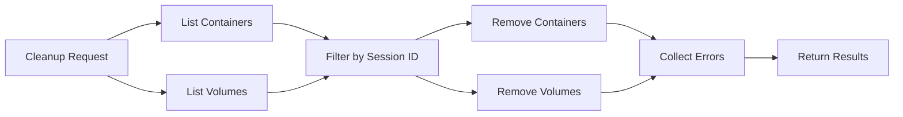
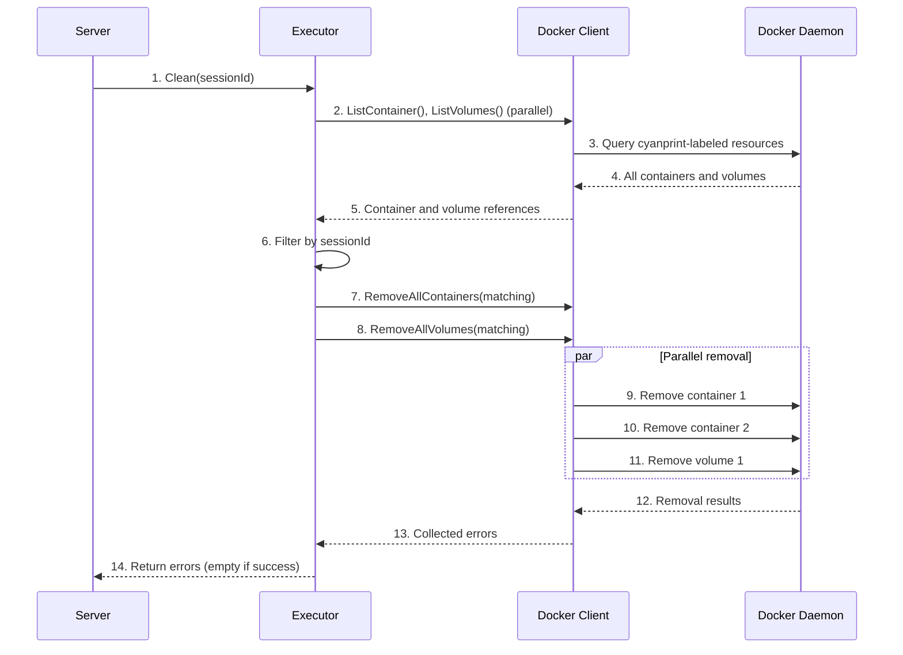

# Cleanup System

**What**: Removes all session-scoped containers and volumes after execution completes.

**Why**: Prevents resource leaks and ensures clean state between executions.

**Key Files**:

- `docker_executor/executor.go:297` → `Clean()`
- `docker_executor/docker.go:243` → `RemoveAllContainers()`
- `docker_executor/docker.go:290` → `RemoveAllVolumes()`

## Overview

The cleanup system provides controlled resource removal:

1. **List resources** - Query Docker for all cyanprint-labeled resources
2. **Filter by session** - Match resources with specific session ID
3. **Remove in parallel** - Delete containers and volumes concurrently
4. **Return errors** - Collect and return all removal errors

Cleanup is triggered by:

- `DELETE /executor/:sessionId` - Manual cleanup API call
- Can be integrated with workflow automation

## Flow

### High-Level



### Detailed



| #   | Step              | What                                         | Key File                         |
| --- | ----------------- | -------------------------------------------- | -------------------------------- |
| 1   | Clean request     | Server calls executor cleanup                | `server.go:34`                   |
| 2   | List resources    | Query for cyanprint containers and volumes   | `executor.go:221`                |
| 3   | Query             | Docker filters by label `cyanprint.dev=true` | `docker.go:147`, `docker.go:411` |
| 4   | Return            | All cyanprint resources                      | `docker.go:174`, `docker.go:429` |
| 5   | References        | Struct representations of containers/volumes | `executor.go:250`                |
| 6   | Filter            | Match by `SessionId == sessionId`            | `executor.go:306`                |
| 7   | Remove containers | Delete matching containers in parallel       | `docker.go:243`                  |
| 8   | Remove volumes    | Delete matching volumes in parallel          | `docker.go:290`                  |
| 9   | Remove            | Docker API call per container                | `docker.go:233`                  |
| 10  | Remove            | Docker API call per container                | `docker.go:233`                  |
| 11  | Remove            | Docker API call per volume                   | `docker.go:283`                  |
| 12  | Results           | Success or error per resource                | `docker.go:240`, `docker.go:287` |
| 13  | Collect           | All errors aggregated                        | `docker.go:265`, `docker.go:311` |
| 14  | Return            | Empty if success, errors if any failures     | `executor.go:325`                |

## Filtering by Session

**Key File**: `executor.go:306` → Session filtering

```go
var sessionContainer []DockerContainerReference
var sessionVolume []DockerVolumeReference

for _, container := range containers {
    if container.SessionId == session {
        sessionContainer = append(sessionContainer, container)
    }
}
```

Only resources matching the session ID are removed.

## Parallel Removal

**Key File**: `docker.go:243` → `RemoveAllContainers()`

Both container and volume removal use parallel execution:

```go
semaphore := make(chan int, d.ParallelismLimit)
errs := make(chan error, len(refs))
for _, ref := range refs {
    go func(r Reference) {
        semaphore <- 0
        defer func() { <-semaphore }()
        errs <- d.RemoveContainer(r)  // or RemoveVolume(r)
    }(ref)
}
for i := 0; i < len(refs); i++ {
    if err := <-errs; err != nil {
        // collect error
    }
}
```

## Container Naming

Containers are named `cyan-<type>-<uuid>-<session>`:

- Template: `cyan-template-<uuid>` (no session)
- Processor: `cyan-processor-<uuid>-<session>`
- Plugin: `cyan-plugin-<uuid>-<session>`
- Merger: `cyan-merger-<uuid>-<session>`

**Key File**: `domain_model.go:48` → `DockerContainerToString()`

## Volume Naming

Volumes are named `cyan-<uuid>` or `cyan-<uuid>-<session>`:

- Template volume: `cyan-<template-uuid>` (no session)
- Session volume: `cyan-<template-uuid>-<session>`

**Key File**: `domain_model.go:79` → `DockerVolumeToString()`

## Edge Cases

| Case                  | Behavior                                                     |
| --------------------- | ------------------------------------------------------------ |
| No matching resources | Returns empty error list (success)                           |
| Some removals fail    | Returns errors for failed items, successful removals persist |
| Container in use      | Force flag enabled, removes anyway                           |
| Volume in use         | Force flag enabled, removes anyway                           |
| Session ID empty      | Would match all resources (caller must validate session ID)  |

## Error Handling

| Error               | Cause                            | Handling                               |
| ------------------- | -------------------------------- | -------------------------------------- |
| Container not found | Already removed or never existed | Logged, continues with other resources |
| Volume in use       | Mounted to running container     | Force removes anyway                   |
| Network error       | Docker daemon unreachable        | Returns error to caller                |

## Related

- [Session Management](./01-session-management.md) - Session ID-based resource naming
- [Parallel Execution](./05-parallel-execution.md) - Semaphore pattern used in cleanup
- [Network Architecture](./10-network-architecture.md) - Network not removed (shared)
