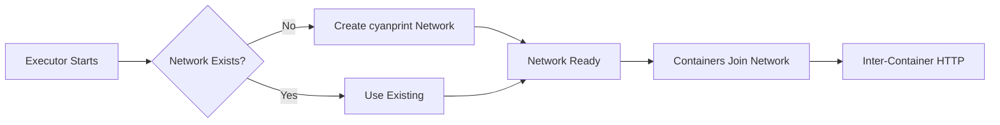
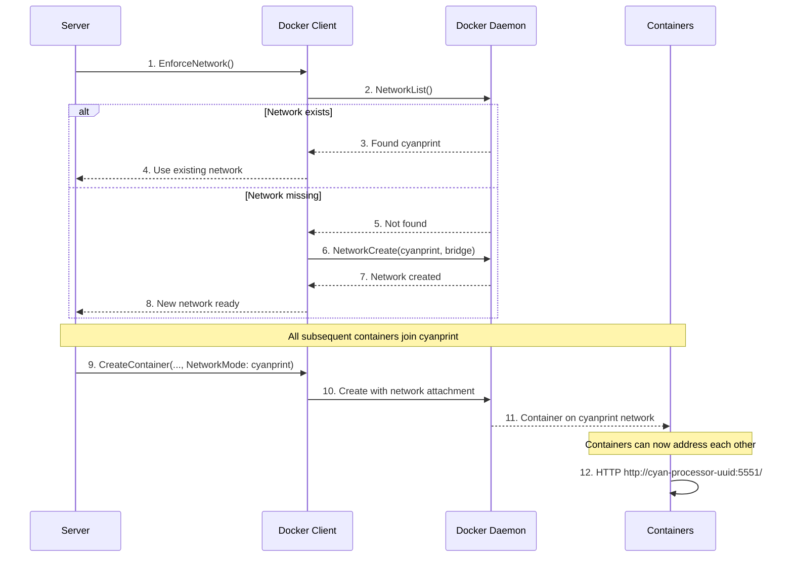

# Network Architecture

**What**: Manages the `cyanprint` Docker bridge network for inter-container communication.

**Why**: Enables HTTP-based communication between containers (health checks, API calls) without complex DNS or port mapping.

**Key Files**:

- `docker_executor/docker.go:391` → `EnforceNetwork()`
- `docker_executor/docker.go:368` → `CyanPrintNetworkExist()`
- `docker_executor/docker.go:381` → `CreateNetwork()`

## Overview

The network architecture provides a **shared bridge network** that:

1. **Auto-creates** - Creates `cyanprint` network if missing on startup
2. **Shared namespace** - All containers join the same network
3. **Predictable addressing** - Containers address each other by name
4. **Internal ports only** - No host port mapping required

This simplifies container-to-container communication for health checks and API calls.

## Flow

### High-Level



### Detailed



| #   | Step             | What                                   | Key File        |
| --- | ---------------- | -------------------------------------- | --------------- |
| 1   | Enforce          | Check/create network before containers | `server.go:214` |
| 2   | List             | Query existing networks                | `docker.go:369` |
| 3   | Found            | Network exists, skip creation          | `docker.go:374` |
| 4   | Existing         | Return success, use existing           | `docker.go:394` |
| 5   | Not found        | Network doesn't exist                  | `docker.go:399` |
| 6   | Create           | Create bridge network                  | `docker.go:382` |
| 7   | Created          | New network ready                      | `docker.go:388` |
| 8   | Ready            | Network available for containers       | `docker.go:406` |
| 9   | Create container | Attach to cyanprint network            | `docker.go:357` |
| 10  | Attach           | Container joins network                | `docker.go:187` |
| 11  | Joined           | Container can communicate              | `docker.go:361` |
| 12  | Communicate      | HTTP between containers by name        | `merger.go:144` |

## Network Configuration

**Key File**: `docker.go:382` → `CreateNetwork()`

```go
_, err := d.Docker.NetworkCreate(ctx, "cyanprint", types.CreateOptions{
    Driver: "bridge",
})
```

**Properties**:

- Name: `cyanprint`
- Driver: `bridge` (default Docker bridge)
- Scope: Local (single host)
- No custom IPAM (uses Docker defaults)

## Container Network Attachment

**Key File**: `docker.go:187` → `CreateContainer()`

All containers use `NetworkMode: "cyanprint"`:

```go
c, err := d.Docker.ContainerCreate(ctx, &container.Config{
    Image: imageName,
    Labels: map[string]string{"cyanprint.dev": "true"},
}, &container.HostConfig{
    NetworkMode: "cyanprint",  // Join the network
}, nil, nil, name)
```

## Container Addressing

Containers address each other by **container name**:

| From        | To        | URL                                                   |
| ----------- | --------- | ----------------------------------------------------- |
| Coordinator | Processor | `http://cyan-processor-uuid-session:5551/`            |
| Coordinator | Plugin    | `http://cyan-plugin-uuid-session:5552/`               |
| Coordinator | Merger    | `http://cyan-merger-uuid-session:9000/`               |
| Merger      | Processor | `http://cyan-processor-uuid-session:5551/api/process` |

**Key File**: `domain_model.go:48` → `DockerContainerToString()`

## DNS Resolution

Docker bridge network provides **automatic DNS**:

- Container name → IP address
- No `/etc/hosts` modification needed
- Immediate resolution after container starts

## Network Persistence

The `cyanprint` network:

- **Persists** after Boron exits
- **Shared** across all Boron instances on same host
- **Not removed** by cleanup (only containers/volumes are removed)

To manually remove:

```bash
docker network rm cyanprint
```

## Edge Cases

| Case                                  | Behavior                                          |
| ------------------------------------- | ------------------------------------------------- |
| Network already exists                | Uses existing, no error                           |
| Network name conflict (non-cyanprint) | Unlikely, cyanprint is specific                   |
| Network deleted during execution      | Existing containers continue, new containers fail |
| Multiple Boron instances              | Share same network, containers can communicate    |

## Related

- [Session Management](./01-session-management.md) - Containers named per session
- [Health Checks](./08-health-checks.md) - HTTP checks over cyanprint network
- [Merger System](./03-merger-system.md) - Inter-container API calls
