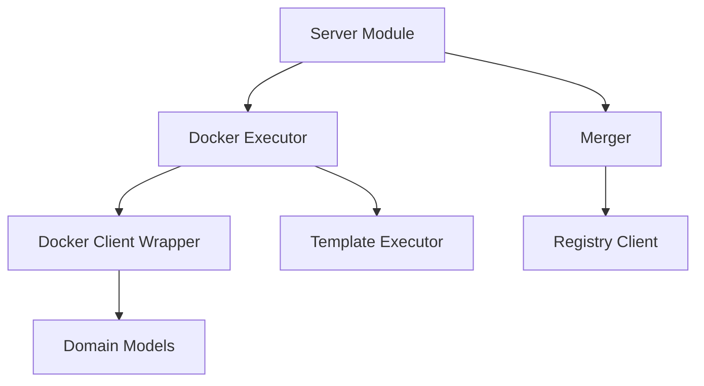

# Modules Overview

Boron is organized into distinct modules, each responsible for a specific aspect of the execution coordination system.

## Map

| Module                | Role                                                        |
| --------------------- | ----------------------------------------------------------- |
| **Server**            | HTTP API layer, routes requests to appropriate modules      |
| **Docker Executor**   | Container lifecycle management (start, health check, clean) |
| **Merger**            | 3-stage pipeline coordination                               |
| **Registry Client**   | Version resolution from Zinc                                |
| **Template Executor** | Template warming (pre-pull, volume creation)                |
| **Domain Models**     | Container/volume/image naming conventions                   |

## All Modules

| Module                                     | What                                     | Why                                               | Key Files                        |
| ------------------------------------------ | ---------------------------------------- | ------------------------------------------------- | -------------------------------- |
| [Server](./01-server.md)                   | Gin HTTP API handlers                    | Provide REST interface for build orchestration    | `server.go:28`                   |
| [Docker Executor](./02-docker-executor.md) | Template execution, container management | Orchestrate container lifecycle and health checks | `executor.go:10`, `docker.go:18` |
| [Merger](./03-merger.md)                   | File consolidation from processors       | Combine parallel outputs into single directory    | `merger.go:15`                   |
| [Registry](./04-registry.md)               | Image registry operations                | Resolve processor/plugin versions from Zinc       | `registry.go:11`                 |

## Groups

### Group 1: API Layer

- **[Server](./01-server.md)** - HTTP endpoints and request handling

### Group 2: Orchestration

- **[Docker Executor](./02-docker-executor.md)** - Container lifecycle
- **[Template Executor](./02-docker-executor.md#templateexecutor)** - Template warming

### Group 3: Pipeline

- **[Merger](./03-merger.md)** - 3-stage execution flow

### Group 4: Integration

- **[Registry](./04-registry.md)** - Zinc registry client
- **[Domain Models](./02-docker-executor.md#domain-models)** - Naming conventions
