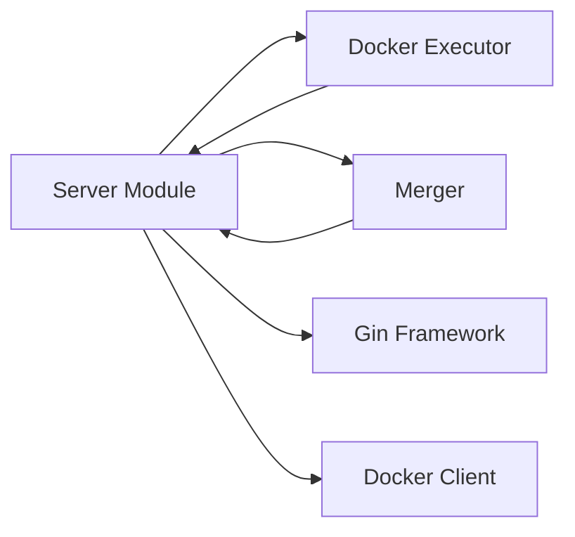

# Server Module

**What**: Gin HTTP API that provides REST endpoints for build orchestration, warming, cleanup, and proxying.

**Why**: Exposes Boron's functionality over HTTP for integration with clients and other services.

**Key Files**:

- `server.go:28` → `server()` function
- `server.go:30` → Root health check
- `server.go:183` → POST /executor (start)

## Responsibilities

- HTTP request handling and routing
- Request/response JSON serialization
- Error handling with Problem Details format
- Streaming tar.gz output to clients
- Proxying requests to template containers

## Structure

```
server.go
├── server()              # Main server function
├── handlers              # HTTP endpoint handlers
│   ├── GET /             # Health check
│   ├── POST /executor    # Start execution
│   ├── POST /executor/:id  # Merge and zip
│   ├── DELETE /executor/:id  # Cleanup
│   ├── POST /executor/:id/warm  # Warm session
│   ├── POST /template/warm  # Warm template
│   ├── POST /proxy/template/*  # Template proxy
│   ├── POST /merge/:id   # Merger endpoint
│   └── POST /zip         # Zip endpoint
└── main()                # CLI entry point
```

| File        | Purpose                                |
| ----------- | -------------------------------------- |
| `server.go` | Gin server with all HTTP handlers      |
| `main.go`   | CLI setup and server startup           |
| `model.go`  | Server-specific request/response types |

## Dependencies



| Dependency      | Why                            |
| --------------- | ------------------------------ |
| Docker Executor | Container lifecycle operations |
| Merger          | 3-stage pipeline coordination  |
| Gin             | HTTP routing and middleware    |
| Docker Client   | Direct Docker API calls        |

## Key Interfaces

### HTTP Handlers

**Key File**: `server.go:28` → `server()`

| Method | Path                        | Purpose          | Key Function          |
| ------ | --------------------------- | ---------------- | --------------------- |
| GET    | `/`                         | Health check     | Health check response |
| POST   | `/executor`                 | Start execution  | `server.go:183`       |
| POST   | `/executor/:sessionId`      | Merge and zip    | `server.go:68`        |
| DELETE | `/executor/:sessionId`      | Cleanup session  | `server.go:34`        |
| POST   | `/executor/:sessionId/warm` | Warm session     | `server.go:248`       |
| POST   | `/template/warm`            | Warm template    | `server.go:312`       |
| POST   | `/proxy/template/:cyanId/*` | Template proxy   | `server.go:371`       |
| POST   | `/merge/:sessionId`         | Merger container | `server.go:503`       |
| POST   | `/zip`                      | Zip directory    | `server.go:531`       |

### Request Types

**Key File**: `model.go:5` → `StartExecutorReq`

```go
type StartExecutorReq struct {
    SessionId         string
    Template          TemplateVersionRes
    WriteVolReference DockerVolumeReference
    Merger            MergerReq
}
```

### Response Types

**Key File**: `model.go:12` → `ProblemDetails`

Standardized error format:

```go
type ProblemDetails struct {
    Title   string
    Status  int
    Detail  string
    Type    string
    TraceId *string
    Data    interface{}
}
```

## Related

- [Docker Executor Module](./02-docker-executor.md) - Used by server for container operations
- [Merger Module](./03-merger.md) - Used for pipeline execution
- [Getting Started](../01-getting-started.md) - Server usage examples
