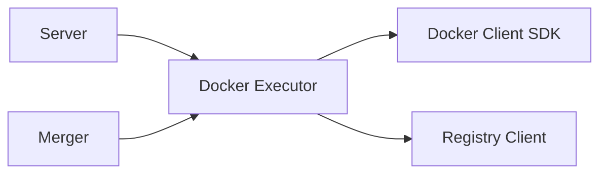

# Docker Executor Module

**What**: Manages Docker container lifecycle including creation, health checks, and cleanup.

**Why**: Provides the core orchestration logic for running processors, plugins, and merger containers.

**Key Files**:
- `docker_executor/executor.go:10` → `Executor` struct
- `docker_executor/docker.go:18` → `DockerClient` struct
- `docker_executor/template_executor.go:10` → `TemplateExecutor` struct

## Responsibilities

What this module is responsible for:
- Container creation and lifecycle management
- Volume creation and mounting
- Image listing and pulling
- Health check polling
- Resource cleanup by session
- Template warming (pre-pull and initialization)

## Structure

```
docker_executor/
├── executor.go           # Main orchestration logic
├── docker.go             # Docker API wrapper
├── template_executor.go  # Template-specific operations
└── domain_model.go       # Naming conventions
```

| File | Purpose |
|------|---------|
| `executor.go` | Main executor for session lifecycle |
| `docker.go` | Docker client wrapper with parallel operations |
| `template_executor.go` | Template warming and initialization |
| `domain_model.go` | Container/volume/image naming and parsing |

## Dependencies



| Dependency | Why |
|------------|-----|
| Docker Client SDK | Container and volume management |
| Registry Client | Image reference resolution |
| Server | Calls executor for container operations |
| Merger | Uses executor for container creation |

## Key Components

### Executor

**Key File**: `executor.go:10` → `Executor` struct

```go
type Executor struct {
    Docker   DockerClient
    Template TemplateVersionRes
}
```

**Methods**:
- `Start()` - Start processors, plugins, merger
- `Warm()` - Pull images, create session volume
- `Clean()` - Remove session containers and volumes
- `statusCheck()` - Health check polling

### DockerClient

**Key File**: `docker.go:18` → `DockerClient` struct

```go
type DockerClient struct {
    Docker           *client.Client
    Context          context.Context
    ParallelismLimit int
}
```

**Methods**:
- `CreateContainerWithReadWriteVolume()` - Create with dual mounts
- `ListContainer()`, `ListVolumes()`, `ListImages()` - Resource listing
- `PullImages()` - Parallel image pulling
- `RemoveAllContainers()`, `RemoveAllVolumes()` - Parallel cleanup
- `EnforceNetwork()` - Ensure cyanprint network exists

### TemplateExecutor

**Key File**: `template_executor.go:10` → `TemplateExecutor` struct

```go
type TemplateExecutor struct {
    Docker   DockerClient
    Template TemplateVersionPrincipalRes
}
```

**Methods**:
- `WarmTemplate()` - Pull template images, create volume and container
- `statusCheck()` - Health check for template container

### Domain Models

**Key Files**: `domain_model.go:21` → `DockerImageReference`, `domain_model.go:42` → `DockerContainerReference`, `domain_model.go:74` → `DockerVolumeReference`

Container, volume, and image naming conventions:

```go
type DockerImageReference struct {
    Reference string
    Tag       string
}

type DockerContainerReference struct {
    CyanId    string
    CyanType  string
    SessionId string
}

type DockerVolumeReference struct {
    CyanId    string
    SessionId string
}
```

## Related

- [Server Module](./01-server.md) - Uses executor for container operations
- [Merger Module](./03-merger.md) - Uses executor for container creation
- [Registry Module](./04-registry.md) - Image version resolution
