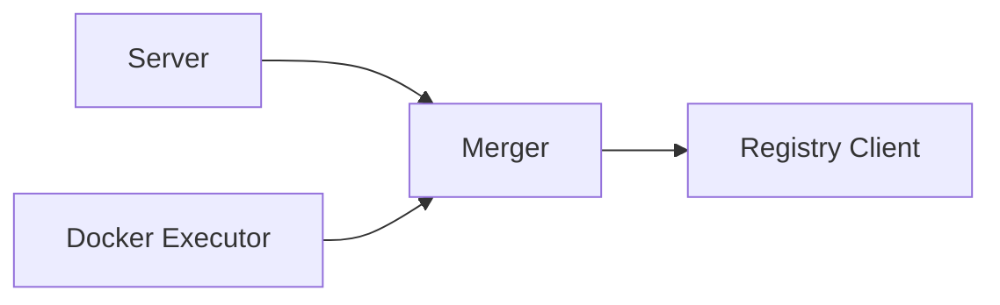

# Merger Module

**What**: Coordinates the 3-stage pipeline (processors → merge → plugins) for code generation.

**Why**: Orchestrates parallel processor execution, output consolidation, and sequential plugin application.

**Key Files**:

- `docker_executor/merger.go:15` → `Merger` struct
- `docker_executor/merger.go:102` → `execProcessors()`
- `docker_executor/merger.go:179` → `execPlugins()`

## Responsibilities

What this module is responsible for:

- Execute processors in parallel via HTTP
- Merge processor outputs into single directory
- Execute plugins sequentially on merged output
- Resolve processor and plugin versions from registry
- Handle errors and collect results

## Structure

```text
merger.go
├── Merger struct           # Main coordinator
├── execProcessors()        # Parallel processor execution
├── execPlugins()           # Sequential plugin execution
├── merge()                 # Call merger container
├── Merge()                 # Public: full 3-stage pipeline
├── MergeFiles()            # Public: file consolidation only
└── PostJSON[Req, Res]()    # Generic HTTP POST helper
```

| File        | Purpose                                       |
| ----------- | --------------------------------------------- |
| `merger.go` | 3-stage pipeline coordination and HTTP client |

## Dependencies



| Dependency      | Why                                 |
| --------------- | ----------------------------------- |
| Registry Client | Resolve processor/plugin versions   |
| Server          | Calls merger for build execution    |
| Docker Executor | Container references for HTTP calls |

## Key Interfaces

### Merger Struct

**Key File**: `merger.go:15` → `Merger` struct

```go
type Merger struct {
    ParallelismLimit int
    RegistryClient   RegistryClient
    Template         TemplateVersionRes
    SessionId        string
}
```

### Pipeline Method

**Key File**: `merger.go:296` → `Merge()`

Main entry point for 3-stage pipeline:

```go
func (m Merger) Merge(req BuildReq) (string, []error)
```

**Returns**: Path to merged output directory

### Processor Execution

**Key File**: `merger.go:102` → `execProcessors()`

```go
func (m Merger) execProcessors(processors []CyanProcessorReq) ([]string, []error)
```

**Returns**: List of output directories, errors

### Plugin Execution

**Key File**: `merger.go:179` → `execPlugins()`

```go
func (m Merger) execPlugins(mergePath string, plugins []CyanPluginReq) []error
```

**Returns**: Errors (nil if all successful)

## Related

- [Merger System Feature](../features/03-merger-system.md) - Feature documentation
- [Docker Executor Module](./02-docker-executor.md) - Container references
- [Registry Module](./04-registry.md) - Version resolution
