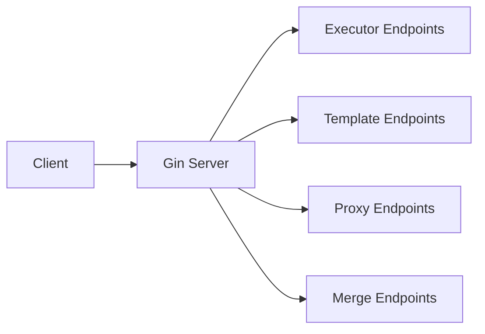

# Surfaces Overview

Boron exposes its functionality through HTTP endpoints.

## Map

| Surface Type | Purpose                                                         | Location  |
| ------------ | --------------------------------------------------------------- | --------- |
| **HTTP API** | REST endpoints for build orchestration, warm, cleanup, proxying | Port 9000 |

## All Surfaces

| Surface       | What                                   | Why                           | Key Files      |
| ------------- | -------------------------------------- | ----------------------------- | -------------- |
| [API](./api/) | REST endpoints for build orchestration | External integration via HTTP | `server.go:28` |

## Groups

### HTTP API

See [API Documentation](./api/) for endpoint details.
